# Forging Vision Foundation Models for Autonomous Driving: Challenges, Methodologies, and Opportunities

[](https://github.com/sindresorhus/awesome) [](https://github.com/Thinklab-SJTU/Awesome-LLM4AD/blob/main/LICENSE)

This repository is largely based on our survey paper:

[](https://arxiv.org/abs/TODO)

[Xu Yan](https://yanx27.github.io/), [Haiming Zhang](https://scholar.google.com/citations?user=RPWMpyIAAAAJ&hl=zh-CN), Yingjie Cai, Jingming Guo, Weichao Qiu, Bin
Gao, Kaiqiang Zhou, Yue Zhao, Huan Jin, Jiantao Gao, [Zhen Li](https://mypage.cuhk.edu.cn/academics/lizhen/), Lihui
Jiang, Wei Zhang, Hongbo Zhang, Dengxin Dai and Bingbing Liu

## Citation
If this work is helpful for your research, please consider citing the following BibTeX entry.
``` bibtex
TBD
```

## Overview
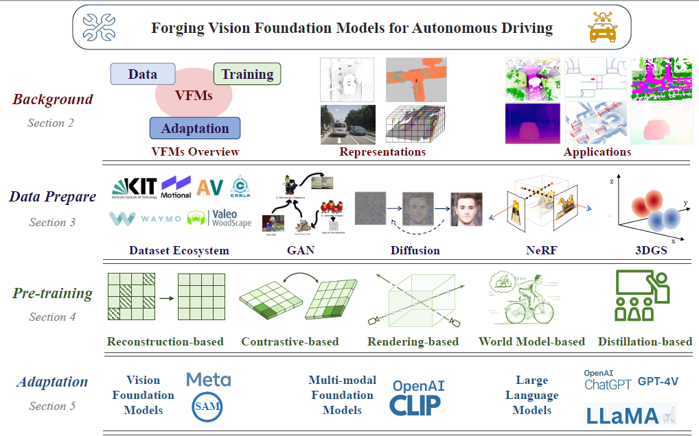

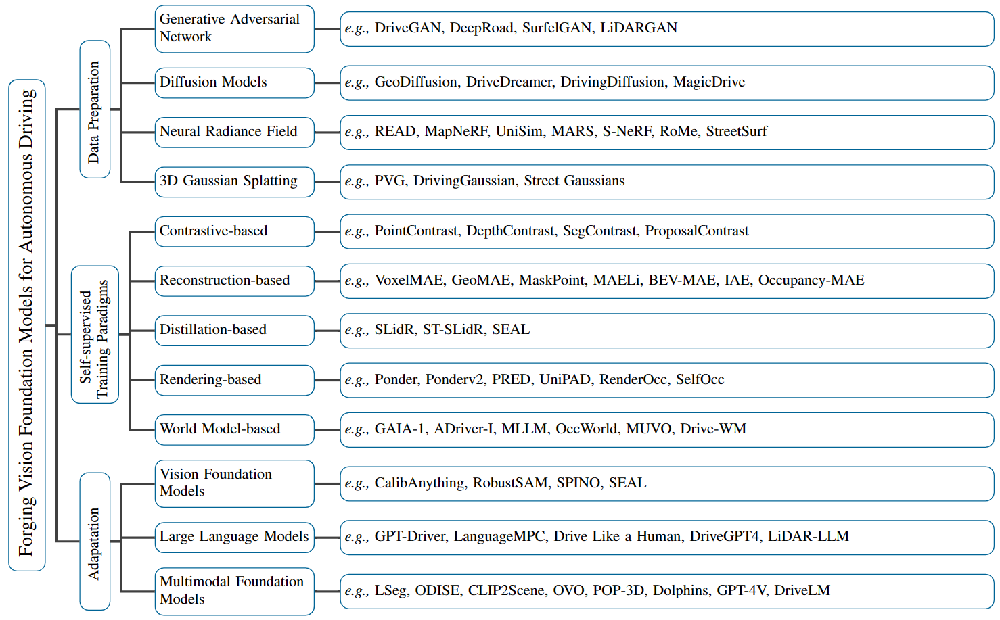

This is the partner repository for the survey paper "Forging Vision Foundation Models for Autonomous Driving: Challenges, Methodologies, and Opportunities". The authors hope this repository can act as a quick reference for researchers who wish to read the relevant papers and implement the associated methods.


**NOTE**: Here we have select a number of featured papers for each part, and almost for each paper we have included the abstract and a figure from the original paper, showing the main framework or motivations, to help us take a glance about these papers (You can expand the **Abstract** button to see them). **More papers list and details can be found in our survey paper**.


⭐ **Welcome to star this repository!** ⭐

We greatly appreciate any contributions via PRs, issues, emails, or other methods.


##  📰 News
- `[2024/01/15]` Release this repository and open-access our survey paper in arXiv.
- `[2023/12/19]` Initial commit.

## Table of Content
- [Related Survey Papers](#related-survey-papers)
- [Data Preparation](#data-preparation)
  - [GAN](#gan)
  - [Diffusion](#diffusion)
  - [NeRF](#nerf)
  - [3D Gaussian Splatting](#3d-gaussian-splatting)
- [Self-supervised Training](#self-supervised-training)
  - [Contrastive](#contrastive)
  - [Reconstruction](#reconstruction)
  - [Distillation](#distillation)
  - [Rendering](#rendering)
  - [World Model](#world-model)
- [Adaptation](#adaptation)
  - [Vision Foundation Models](#vision-foundation-models)
  - [Large Language Models](#large-language-models)
  - [Multimodal Foundation Models](#multimodal-foundation-models)

## Related Survey Papers
- **Foundation Models in Robotics: Applications, Challenges, and the Future**.
    <details span>
    <summary>Abstract</summary>
    We survey applications of pretrained foundation models in robotics. Traditional deep learning models in robotics are trained on small datasets tailored for specific tasks, which limits their adaptability across diverse applications. In contrast, foundation models pretrained on internet-scale data appear to have superior generalization capabilities, and in some instances display an emergent ability to find zero-shot solutions to problems that are not present in the training data. Foundation models may hold the potential to enhance various components of the robot autonomy stack, from perception to decision-making and control. For example, large language models can generate code or provide common sense reasoning, while vision-language models enable open-vocabulary visual recognition. However, significant open research challenges remain, particularly around the scarcity of robot-relevant training data, safety guarantees and uncertainty quantification, and real-time execution. In this survey, we study recent papers that have used or built foundation models to solve robotics problems. We explore how foundation models contribute to improving robot capabilities in the domains of perception, decision-making, and control. We discuss the challenges hindering the adoption of foundation models in robot autonomy and provide opportunities and potential pathways for future advancements.
    </details>

    [](https://arxiv.org/abs/2312.07843) [](https://github.com/robotics-survey/Awesome-Robotics-Foundation-Models)

- **Applications of Large Scale Foundation Models for Autonomous Driving**.
    <details span>
    <summary>Abstract</summary>
    Since DARPA Grand Challenges (rural) in 2004/05 and Urban Challenges in 2007, autonomous driving has been the most active field of AI applications. Recently powered by large language models (LLMs), chat systems, such as chatGPT and PaLM, emerge and rapidly become a promising direction to achieve artificial general intelligence (AGI) in natural language processing (NLP). There comes a natural thinking that we could employ these abilities to reformulate autonomous driving. By combining LLM with foundation models, it is possible to utilize the human knowledge, commonsense and reasoning to rebuild autonomous driving systems from the current long-tailed AI dilemma. In this paper, we investigate the techniques of foundation models and LLMs applied for autonomous driving, categorized as simulation, world model, data annotation and planning or E2E solutions etc.
    </details>

    [](https://arxiv.org/abs/2311.12144)

- **Vision Language Models in Autonomous Driving and Intelligent Transportation Systems**.
    <details span>
    <summary>Abstract</summary>
    TODOThe applications of Vision-Language Models (VLMs) in the fields of Autonomous Driving (AD) and Intelligent Transportation Systems (ITS) have attracted widespread attention due to their outstanding performance and the ability to leverage Large Language Models (LLMs). By integrating language data, the vehicles, and transportation systems are able to deeply understand real-world environments, improving driving safety and efficiency. In this work, we present a comprehensive survey of the advances in language models in this domain, encompassing current models and datasets. Additionally, we explore the potential applications and emerging research directions. Finally, we thoroughly discuss the challenges and research gap. The paper aims to provide researchers with the current work and future trends of VLMs in AD and ITS.

    <div align=center>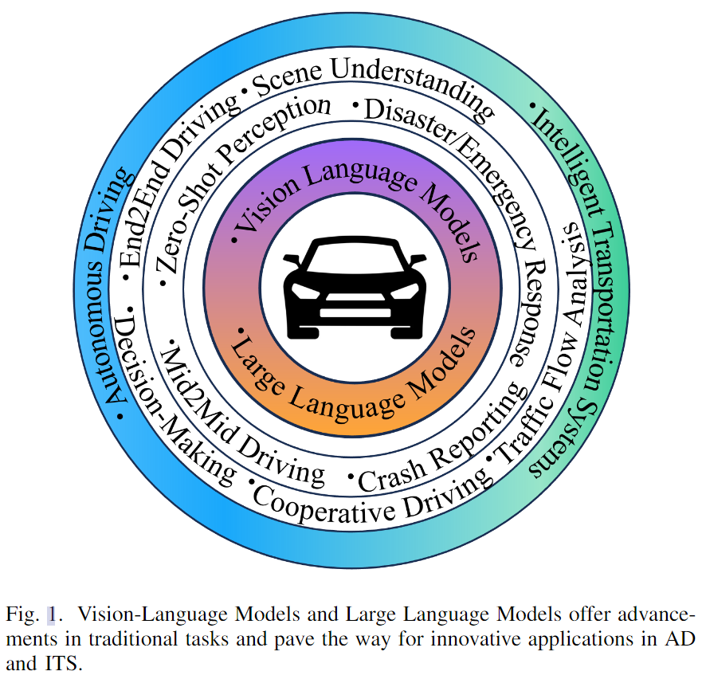</div>
    </details>

    [](https://arxiv.org/abs/2310.14414)

- **A Comprehensive Survey on Segment Anything Model for Vision and Beyond**.
    <details span>
    <summary>Abstract</summary>
    Artificial intelligence (AI) is evolving towards artificial general intelligence, which refers to the ability of an AI system to perform a wide range of tasks and exhibit a level of intelligence similar to that of a human being. This is in contrast to narrow or specialized AI, which is designed to perform specific tasks with a high degree of efficiency. Therefore, it is urgent to design a general class of models, which we term foundation models, trained on broad data that can be adapted to various downstream tasks. The recently proposed segment anything model (SAM) has made significant progress in breaking the boundaries of segmentation, greatly promoting the development of foundation models for computer vision. To fully comprehend SAM, we conduct a survey study. As the first to comprehensively review the progress of segmenting anything task for vision and beyond based on the foundation model of SAM, this work focuses on its applications to various tasks and data types by discussing its historical development, recent progress, and profound impact on broad applications. We first introduce the background and terminology for foundation models including SAM, as well as state-of-the-art methods contemporaneous with SAM that are significant for segmenting anything task. Then, we analyze and summarize the advantages and limitations of SAM across various image processing applications, including software scenes, real-world scenes, and complex scenes. Importantly, many insights are drawn to guide future research to develop more versatile foundation models and improve the architecture of SAM. We also summarize massive other amazing applications of SAM in vision and beyond.
    </details>

    [](https://arxiv.org/abs/2305.08196) [](https://github.com/liliu-avril/Awesome-Segment-Anything)
    
- **Foundation Models for Decision Making: Problems, Methods, and Opportunities**.
    <details span>
    <summary>Abstract</summary>
    Foundation models pretrained on diverse data at scale have demonstrated extraordinary capabilities in a wide range of vision and language tasks. When such models are deployed in real world environments, they inevitably interface with other entities and agents. For example, language models are often used to interact with human beings through dialogue, and visual perception models are used to autonomously navigate neighborhood streets. In response to these developments, new paradigms are emerging for training foundation models to interact with other agents and perform long-term reasoning. These paradigms leverage the existence of ever-larger datasets curated for multimodal, multitask, and generalist interaction. Research at the intersection of foundation models and decision making holds tremendous promise for creating powerful new systems that can interact effectively across a diverse range of applications such as dialogue, autonomous driving, healthcare, education, and robotics. In this manuscript, we examine the scope of foundation models for decision making, and provide conceptual tools and technical background for understanding the problem space and exploring new research directions. We review recent approaches that ground foundation models in practical decision making applications through a variety of methods such as prompting, conditional generative modeling, planning, optimal control, and reinforcement learning, and discuss common challenges and open problems in the field.

    <div align=center>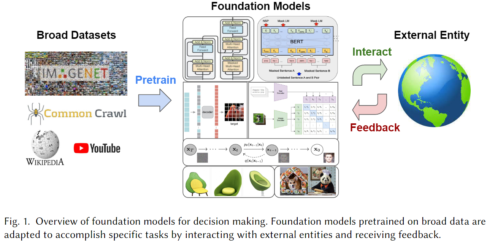</div>
    </details>

    [](https://arxiv.org/abs/2303.04129)


- **A Survey of Large Language Models for Autonomous Driving**.
    <details span>
    <summary>Abstract</summary>
    Autonomous driving technology, a catalyst for revolutionizing transportation and urban mobility, has the tend to transition from rule-based systems to data-driven strategies. Traditional module-based systems are constrained by cumulative errors among cascaded modules and inflexible pre-set rules. In contrast, end-to-end autonomous driving systems have the potential to avoid error accumulation due to their fully data-driven training process, although they often lack transparency due to their ``black box" nature, complicating the validation and traceability of decisions. Recently, large language models (LLMs) have demonstrated abilities including understanding context, logical reasoning, and generating answers. A natural thought is to utilize these abilities to empower autonomous driving. By combining LLM with foundation vision models, it could open the door to open-world understanding, reasoning, and few-shot learning, which current autonomous driving systems are lacking. In this paper, we systematically review a research line about \textit{Large Language Models for Autonomous Driving (LLM4AD)}. This study evaluates the current state of technological advancements, distinctly outlining the principal challenges and prospective directions for the field.

    <div align=center>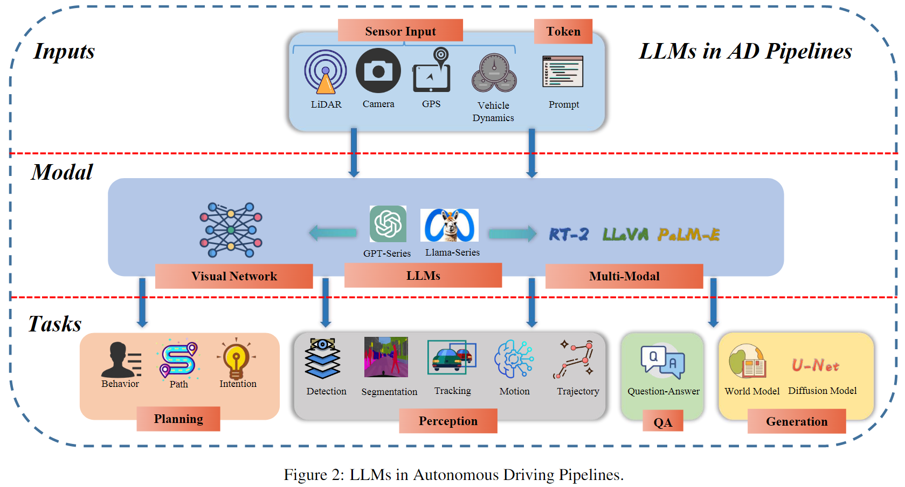</div>
    </details>

    [](https://arxiv.org/abs/2304.10406) [](https://github.com/Thinklab-SJTU/Awesome-LLM4AD)

- **On the Opportunities and Risks of Foundation Models**.
    <details span>
    <summary>Abstract</summary>
    AI is undergoing a paradigm shift with the rise of models (e.g., BERT, DALL-E, GPT-3) that are trained on broad data at scale and are adaptable to a wide range of downstream tasks. We call these models foundation models to underscore their critically central yet incomplete character. This report provides a thorough account of the opportunities and risks of foundation models, ranging from their capabilities (e.g., language, vision, robotics, reasoning, human interaction) and technical principles(e.g., model architectures, training procedures, data, systems, security, evaluation, theory) to their applications (e.g., law, healthcare, education) and societal impact (e.g., inequity, misuse, economic and environmental impact, legal and ethical considerations). Though foundation models are based on standard deep learning and transfer learning, their scale results in new emergent capabilities,and their effectiveness across so many tasks incentivizes homogenization. Homogenization provides powerful leverage but demands caution, as the defects of the foundation model are inherited by all the adapted models downstream. Despite the impending widespread deployment of foundation models, we currently lack a clear understanding of how they work, when they fail, and what they are even capable of due to their emergent properties. To tackle these questions, we believe much of the critical research on foundation models will require deep interdisciplinary collaboration commensurate with their fundamentally sociotechnical nature.

    <div align=center>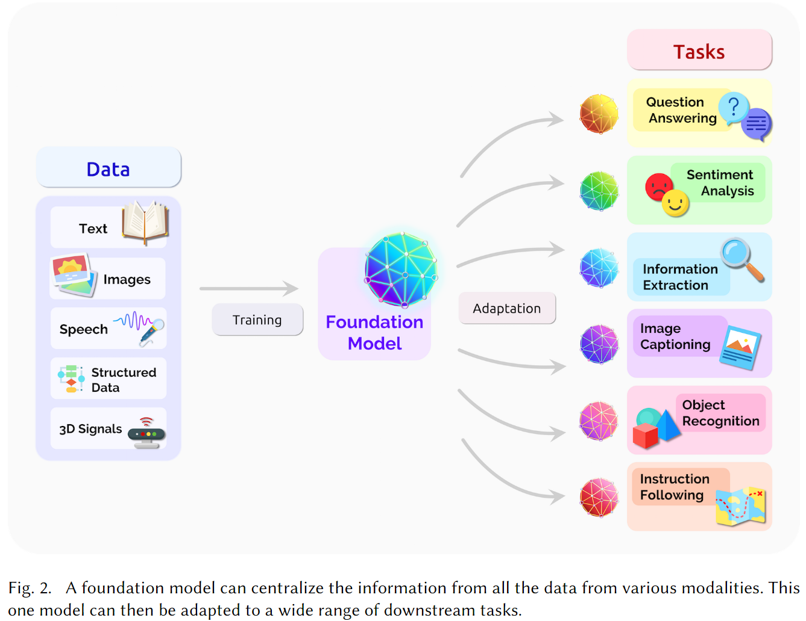</div>
    </details>

    [](https://arxiv.org/abs/2108.07258) [](https://crfm.stanford.edu/report.html)

👆 [Back to Top](#Table-of-Content)

## Data Preparation
### GAN
- **DriveGAN: Towards a Controllable High-Quality Neural Simulation**. 
    <details span>
    <summary>Abstract</summary>
    Realistic simulators are critical for training and verifying robotics systems. While most of the contemporary simulators are hand-crafted, a scaleable way to build simulators is to use machine learning to learn how the environment behaves in response to an action, directly from data. In this work, we aim to learn to simulate a dynamic environment directly in pixel-space, by watching unannotated sequences of frames and their associated action pairs. We introduce a novel high-quality neural simulator referred to as DriveGAN that achieves controllability by disentangling different components without supervision. In addition to steering controls, it also includes controls for sampling features of a scene, such as the weather as well as the location of non-player objects. Since DriveGAN is a fully differentiable simulator, it further allows for re-simulation of a given video sequence, offering an agent to drive through a recorded scene again, possibly taking different actions. We train DriveGAN on multiple datasets, including 160 hours of real-world driving data. We showcase that our approach greatly surpasses the performance of previous data-driven simulators, and allows for new features not explored before.

    <div align=center>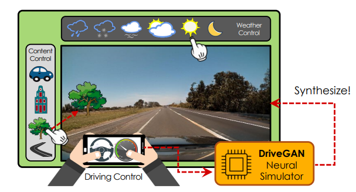</div>
    </details>

    [](https://arxiv.org/abs/2104.15060) [](https://research.nvidia.com/labs/toronto-ai/DriveGAN/)


- **SurfelGAN: Synthesizing Realistic Sensor Data for Autonomous Driving**. 
    <details span>
    <summary>Abstract</summary>
    Autonomous driving system development is critically dependent on the ability to replay complex and diverse traffic scenarios in simulation. In such scenarios, the ability to accurately simulate the vehicle sensors such as cameras, lidar or radar is essential. However, current sensor simulators leverage gaming engines such as Unreal or Unity, requiring manual creation of environments, objects and material properties. Such approaches have limited scalability and fail to produce realistic approximations of camera, lidar, and radar data without significant additional work. In this paper, we present a simple yet effective approach to generate realistic scenario sensor data, based only on a limited amount of lidar and camera data collected by an autonomous vehicle. Our approach uses texture-mapped surfels to efficiently reconstruct the scene from an initial vehicle pass or set of passes, preserving rich information about object 3D geometry and appearance, as well as the scene conditions. We then leverage a SurfelGAN network to reconstruct realistic camera images for novel positions and orientations of the self-driving vehicle and moving objects in the scene. We demonstrate our approach on the Waymo Open Dataset and show that it can synthesize realistic camera data for simulated scenarios. We also create a novel dataset that contains cases in which two self-driving vehicles observe the same scene at the same time. We use this dataset to provide additional evaluation and demonstrate the usefulness of our SurfelGAN model.

    <div align=center></div>
    </details>

    [](https://arxiv.org/abs/2005.03844)

- **GAN-Based LiDAR Translation between Sunny and Adverse Weather for Autonomous Driving and Driving Simulation**.
    <details span>
    <summary>Abstract</summary>
    Autonomous driving requires robust and highly accurate perception technologies. Various deep learning algorithms based on only image processing satisfy this requirement, but few such algorithms are based on LiDAR. However, images are only one part of the perceptible sensors in an autonomous driving vehicle; LiDAR is also essential for the recognition of driving environments. The main reason why there exist few deep learning algorithms based on LiDAR is a lack of data. Recent translation technology using generative adversarial networks (GANs) has been proposed to deal with this problem. However, these technologies focus on only image-to-image translation, although a lack of data occurs more often with LiDAR than with images. LiDAR translation technology is required not only for data augmentation, but also for driving simulation, which allows algorithms to practice driving as if they were commanding a real vehicle, before doing so in the real world. In other words, driving simulation is a key technology for evaluating and verifying algorithms which are practically applied to vehicles. In this paper, we propose a GAN-based LiDAR translation algorithm for autonomous driving and driving simulation. It is the first LiDAR translation approach that can deal with various types of weather that are based on an empirical approach. We tested the proposed method on the JARI data set, which was collected under various adverse weather scenarios with diverse precipitation and visible distance settings. The proposed method was also applied to the real-world Spain data set. Our experimental results demonstrate that the proposed method can generate realistic LiDAR data under adverse weather conditions.

    <div align=center>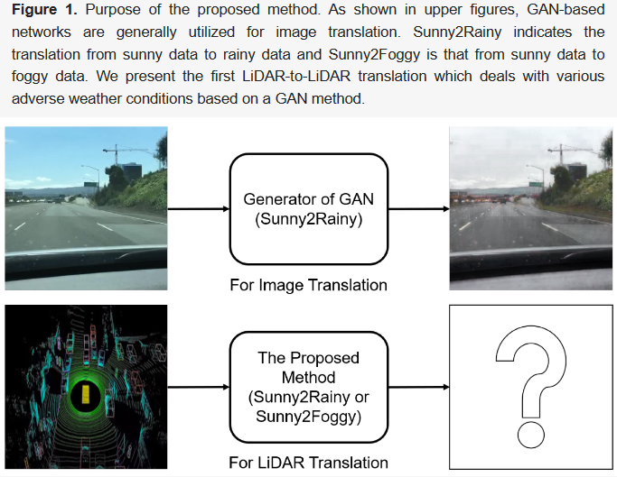</div>
    </details>

    [](https://www.mdpi.com/1424-8220/22/14/5287)


- **LiDAR Sensor modeling and Data augmentation with GANs for Autonomous driving**.
    <details span>
    <summary>Abstract</summary>
    In the autonomous driving domain, data collection and annotation from real vehicles are expensive and sometimes unsafe. Simulators are often used for data augmentation, which requires realistic sensor models that are hard to formulate and model in closed forms. Instead, sensors models can be learned from real data. The main challenge is the absence of paired data set, which makes traditional supervised learning techniques not suitable. In this work, we formulate the problem as image translation from unpaired data and employ CycleGANs to solve the sensor modeling problem for LiDAR, to produce realistic LiDAR from simulated LiDAR (sim2real). Further, we generate high-resolution, realistic LiDAR from lower resolution one (real2real). The LiDAR 3D point cloud is processed in Bird-eye View and Polar 2D representations. The experimental results show a high potential of the proposed approach.
    </details>

    [](https://arxiv.org/abs/1905.07290) [](https://github.com/ahmadelsallab/lidargan)

- **DeepRoad: GAN-based Metamorphic Autonomous Driving System Testing**.
    <details span>
    <summary>Abstract</summary>
    While Deep Neural Networks (DNNs) have established the fundamentals of DNN-based autonomous driving systems, they may exhibit erroneous behaviors and cause fatal accidents. To resolve the safety issues of autonomous driving systems, a recent set of testing techniques have been designed to automatically generate test cases, e.g., new input images transformed from the original ones. Unfortunately, many such generated input images often render inferior authenticity, lacking accurate semantic information of the driving scenes and hence compromising the resulting efficacy and reliability.In this paper, we propose DeepRoad, an unsupervised framework to automatically generate large amounts of accurate driving scenes to test the consistency of DNN-based autonomous driving systems across different scenes. In particular, DeepRoad delivers driving scenes with various weather conditions (including those with rather extreme conditions) by applying the Generative Adversarial Networks (GANs) along with the corresponding real-world weather scenes. Moreover, we have implemented DeepRoad to test three well-recognized DNN-based autonomous driving systems. Experimental results demonstrate that DeepRoad can detect thousands of behavioral inconsistencies in these systems.

    <div align=center>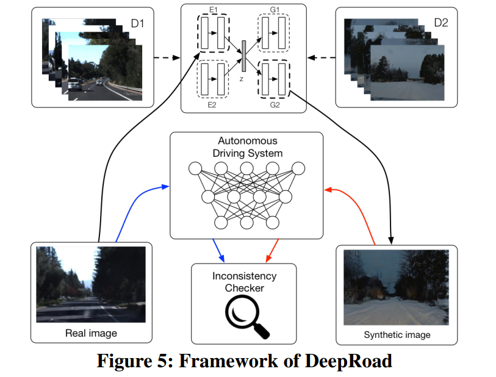</div>
    </details>

    [](https://arxiv.org/abs/1802.02295)

- **Deep generative modeling of lidar data**.
    <details span>
    <summary>Abstract</summary>
    Building models capable of generating structured output is a key challenge for AI and robotics. While generative models have been explored on many types of data, little work has been done on synthesizing lidar scans, which play a key role in robot mapping and localization. In this work, we show that one can adapt deep generative models for this task by unravelling lidar scans into a 2D point map. Our approach can generate high quality samples, while simultaneously learning a meaningful latent representation of the data. We demonstrate significant improvements against state-of-the-art point cloud generation methods. Furthermore, we propose a novel data representation that augments the 2D signal with absolute positional information. We show that this helps robustness to noisy and imputed input; the learned model can recover the underlying lidar scan from seemingly uninformative data.

    <div align=center>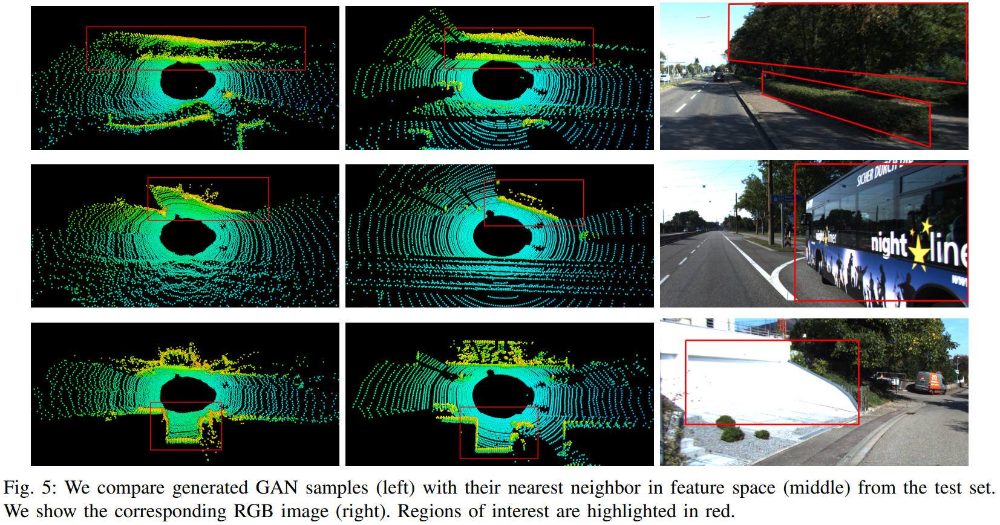</div>
    </details>

    [](https://arxiv.org/abs/1812.01180) [](https://github.com/pclucas14/lidar_generation)


👆 [Back to Top](#Table-of-Content)


### Diffusion
- **GeoDiffusion: Text-Prompted Geometric Control for Object Detection Data Generation**.
    <details span>
    <summary>Abstract</summary>
    Diffusion models have attracted significant attention due to the remarkable ability to create content and generate data for tasks like image classification. However, the usage of diffusion models to generate the high-quality object detection data remains an underexplored area, where not only image-level perceptual quality but also geometric conditions such as bounding boxes and camera views are essential. Previous studies have utilized either copy-paste synthesis or layout-to-image (L2I) generation with specifically designed modules to encode semantic layouts. In this paper, we propose GeoDiffusion, a simple framework that can flexibly translate various geometric conditions into text prompts and empower pre-trained text-to-image (T2I) diffusion models for high-quality detection data generation. Unlike previous L2I methods, our GeoDiffusion is able to encode not only the bounding boxes but also extra geometric conditions such as camera views in self-driving scenes. Extensive experiments demonstrate GeoDiffusion outperforms previous L2I methods while maintaining 4x training time faster. To the best of our knowledge, this is the first work to adopt diffusion models for layout-to-image generation with geometric conditions and demonstrate that L2I-generated images can be beneficial for improving the performance of object detectors.

    <div align=center>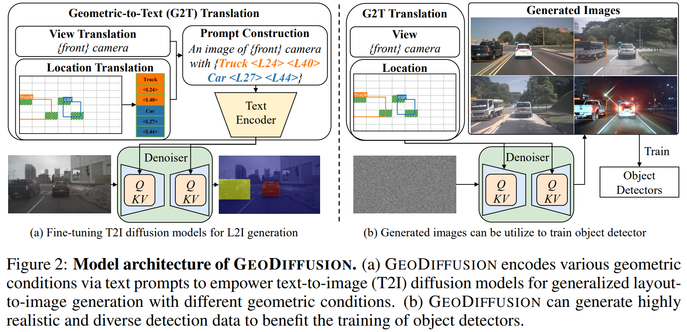</div>
    </details>

    [](https://arxiv.org/abs/2306.04607) [](https://kaichen1998.github.io/projects/geodiffusion/) [](https://github.com/KaiChen1998/GeoDiffusion/tree/main)

- **DrivingDiffusion: Layout-Guided multi-view driving scene video generation with latent diffusion model**.
    <details span>
    <summary>Abstract</summary>
    With the increasing popularity of autonomous driving based on the powerful and unified bird's-eye-view (BEV) representation, a demand for high-quality and large-scale multi-view video data with accurate annotation is urgently required. However, such large-scale multi-view data is hard to obtain due to expensive collection and annotation costs. To alleviate the problem, we propose a spatial-temporal consistent diffusion framework DrivingDiffusion, to generate realistic multi-view videos controlled by 3D layout. There are three challenges when synthesizing multi-view videos given a 3D layout: How to keep 1) cross-view consistency and 2) cross-frame consistency? 3) How to guarantee the quality of the generated instances? Our DrivingDiffusion solves the problem by cascading the multi-view single-frame image generation step, the single-view video generation step shared by multiple cameras, and post-processing that can handle long video generation. In the multi-view model, the consistency of multi-view images is ensured by information exchange between adjacent cameras. In the temporal model, we mainly query the information that needs attention in subsequent frame generation from the multi-view images of the first frame. We also introduce the local prompt to effectively improve the quality of generated instances. In post-processing, we further enhance the cross-view consistency of subsequent frames and extend the video length by employing temporal sliding window algorithm. Without any extra cost, our model can generate large-scale realistic multi-camera driving videos in complex urban scenes, fueling the downstream driving tasks. The code will be made publicly available.

    <div align=center></div>
    </details>

    [](https://arxiv.org/abs/2310.07771) [](https://drivingdiffusion.github.io/) [](https://github.com/shalfun/DrivingDiffusion)


- **MagicDrive: Street View Generation with Diverse 3D Geometry Control**.
    <details span>
    <summary>Abstract</summary>
    Recent advancements in diffusion models have significantly enhanced the data synthesis with 2D control. Yet, precise 3D control in street view generation, crucial for 3D perception tasks, remains elusive. Specifically, utilizing Bird's-Eye View (BEV) as the primary condition often leads to challenges in geometry control (e.g., height), affecting the representation of object shapes, occlusion patterns, and road surface elevations, all of which are essential to perception data synthesis, especially for 3D object detection tasks. In this paper, we introduce MagicDrive, a novel street view generation framework offering diverse 3D geometry controls, including camera poses, road maps, and 3D bounding boxes, together with textual descriptions, achieved through tailored encoding strategies. Besides, our design incorporates a cross-view attention module, ensuring consistency across multiple camera views. With MagicDrive, we achieve high-fidelity street-view synthesis that captures nuanced 3D geometry and various scene descriptions, enhancing tasks like BEV segmentation and 3D object detection.

    <div align=center>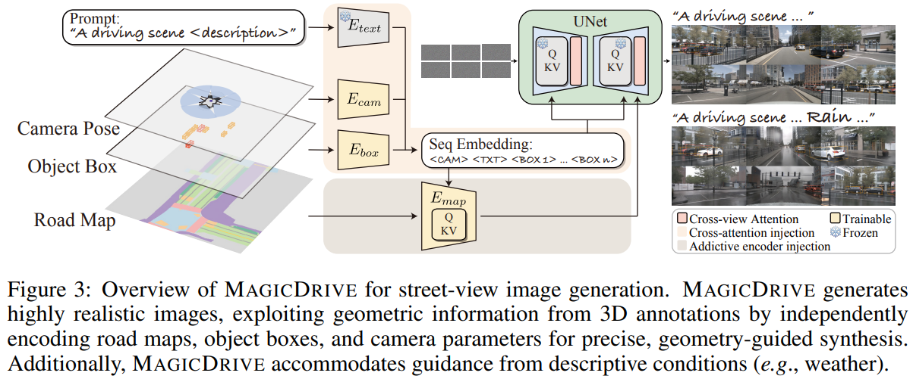</div>
    </details>

    [](https://arxiv.org/abs/2310.02601) [](https://flymin.github.io/magicdrive) [](https://github.com/cure-lab/MagicDrive)


- **DatasetDM: Synthesizing Data with Perception Annotations Using Diffusion Models**.
    <details span>
    <summary>Abstract</summary>
    Current deep networks are very data-hungry and benefit from training on largescale datasets, which are often time-consuming to collect and annotate. By contrast, synthetic data can be generated infinitely using generative models such as DALL-E and diffusion models, with minimal effort and cost. In this paper, we present DatasetDM, a generic dataset generation model that can produce diverse synthetic images and the corresponding high-quality perception annotations (e.g., segmentation masks, and depth). Our method builds upon the pre-trained diffusion model and extends text-guided image synthesis to perception data generation. We show that the rich latent code of the diffusion model can be effectively decoded as accurate perception annotations using a decoder module. Training the decoder only needs less than 1% (around 100 images) manually labeled images, enabling the generation of an infinitely large annotated dataset. Then these synthetic data can be used for training various perception models for downstream tasks. To showcase the power of the proposed approach, we generate datasets with rich dense pixel-wise labels for a wide range of downstream tasks, including semantic segmentation, instance segmentation, and depth estimation. Notably, it achieves 1) state-of-the-art results on semantic segmentation and instance segmentation; 2) significantly more robust on domain generalization than using the real data alone; and state-of-the-art results in zero-shot segmentation setting; and 3) flexibility for efficient application and novel task composition (e.g., image editing).

    <div align=center>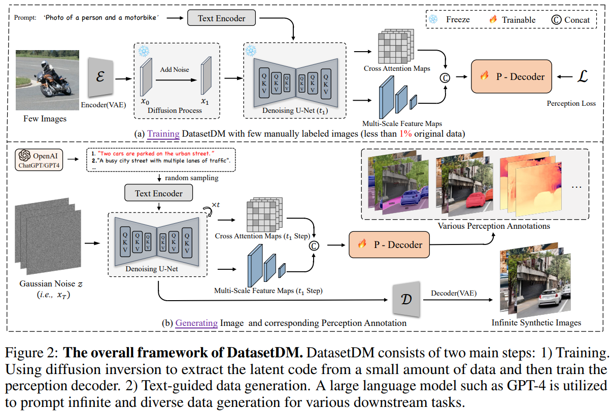</div>
    </details>

    [](https://arxiv.org/abs/2308.06160) [](https://weijiawu.github.io/DatasetDM_page/) [](https://github.com/showlab/DatasetDM)

👆 [Back to Top](#Table-of-Content)


### NeRF


- **UniSim: Synthesizing Data with Perception Annotations Using Diffusion Models**.
    <details span>
    <summary>Abstract</summary>
    Rigorously testing autonomy systems is essential for making safe self-driving vehicles (SDV) a reality. It requires one to generate safety critical scenarios beyond what can be collected safely in the world, as many scenarios happen rarely on public roads. To accurately evaluate performance, we need to test the SDV on these scenarios in closed-loop, where the SDV and other actors interact with each other at each timestep. Previously recorded driving logs provide a rich resource to build these new scenarios from, but for closed loop evaluation, we need to modify the sensor data based on the new scene configuration and the SDV's decisions, as actors might be added or removed and the trajectories of existing actors and the SDV will differ from the original log. In this paper, we present UniSim, a neural sensor simulator that takes a single recorded log captured by a sensor-equipped vehicle and converts it into a realistic closed-loop multi-sensor simulation. UniSim builds neural feature grids to reconstruct both the static background and dynamic actors in the scene, and composites them together to simulate LiDAR and camera data at new viewpoints, with actors added or removed and at new placements. To better handle extrapolated views, we incorporate learnable priors for dynamic objects, and leverage a convolutional network to complete unseen regions. Our experiments show UniSim can simulate realistic sensor data with small domain gap on downstream tasks. With UniSim, we demonstrate closed-loop evaluation of an autonomy system on safety-critical scenarios as if it were in the real world.

    <div align=center>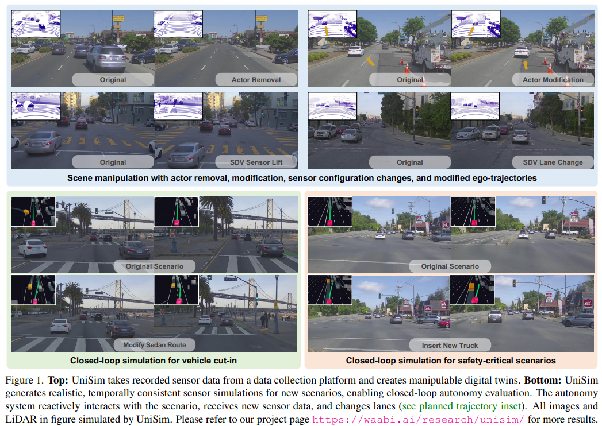</div>
    </details>

    [](https://arxiv.org/abs/2308.01898) [](https://waabi.ai/unisim/)

- **MARS: An Instance-aware, Modular and Realistic Simulator for Autonomous Driving**.
    <details span>
    <summary>Abstract</summary>
    Nowadays, autonomous cars can drive smoothly in ordinary cases, and it is widely recognized that realistic sensor simulation will play a critical role in solving remaining corner cases by simulating them. To this end, we propose an autonomous driving simulator based upon neural radiance fields (NeRFs). Compared with existing works, ours has three notable features: (1) Instance-aware. Our simulator models the foreground instances and background environments separately with independent networks so that the static (e.g., size and appearance) and dynamic (e.g., trajectory) properties of instances can be controlled separately. (2) Modular. Our simulator allows flexible switching between different modern NeRF-related backbones, sampling strategies, input modalities, etc. We expect this modular design to boost academic progress and industrial deployment of NeRF-based autonomous driving simulation. (3) Realistic. Our simulator set new state-of-the-art photo-realism results given the best module selection. Our simulator will be open-sourced while most of our counterparts are not.

    <div align=center>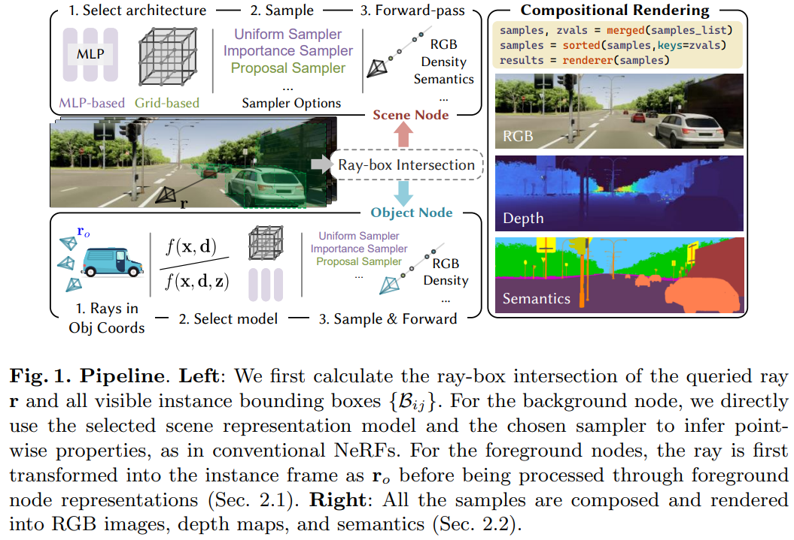</div>
    </details>

    [](https://arxiv.org/abs/2307.15058) [](https://open-air-sun.github.io/mars/) [](https://github.com/OPEN-AIR-SUN/mars)

- **NeRF-LiDAR: Generating Realistic LiDAR Point Clouds with Neural Radiance Fields**.
    <details span>
    <summary>Abstract</summary>
    Labeling LiDAR point clouds for training autonomous driving is extremely expensive and difficult. LiDAR simulation aims at generating realistic LiDAR data with labels for training and verifying self-driving algorithms more efficiently. Recently, Neural Radiance Fields (NeRF) have been proposed for novel view synthesis using implicit reconstruction of 3D scenes. Inspired by this, we present NeRF-LIDAR, a novel LiDAR simulation method that leverages real-world information to generate realistic LIDAR point clouds. Different from existing LiDAR simulators, we use real images and point cloud data collected by self-driving cars to learn the 3D scene representation, point cloud generation and label rendering. We verify the effectiveness of our NeRF-LiDAR by training different 3D segmentation models on the generated LiDAR point clouds. It reveals that the trained models are able to achieve similar accuracy when compared with the same model trained on the real LiDAR data. Besides, the generated data is capable of boosting the accuracy through pre-training which helps reduce the requirements of the real labeled data.

    <div align=center>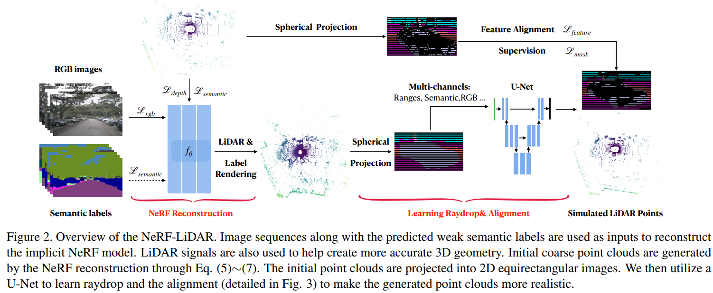</div>
    </details>

    [](https://arxiv.org/abs/2304.14811)

- **StreetSurf: Extending Multi-view Implicit Surface Reconstruction to Street Views**.
    <details span>
    <summary>Abstract</summary>
    We present a novel multi-view implicit surface reconstruction technique, termed StreetSurf, that is readily applicable to street view images in widely-used autonomous driving datasets, such as Waymo-perception sequences, without necessarily requiring LiDAR data. As neural rendering research expands rapidly, its integration into street views has started to draw interests. Existing approaches on street views either mainly focus on novel view synthesis with little exploration of the scene geometry, or rely heavily on dense LiDAR data when investigating reconstruction. Neither of them investigates multi-view implicit surface reconstruction, especially under settings without LiDAR data. Our method extends prior object-centric neural surface reconstruction techniques to address the unique challenges posed by the unbounded street views that are captured with non-object-centric, long and narrow camera trajectories. We delimit the unbounded space into three parts, close-range, distant-view and sky, with aligned cuboid boundaries, and adapt cuboid/hyper-cuboid hash-grids along with road-surface initialization scheme for finer and disentangled representation. To further address the geometric errors arising from textureless regions and insufficient viewing angles, we adopt geometric priors that are estimated using general purpose monocular models. Coupled with our implementation of efficient and fine-grained multi-stage ray marching strategy, we achieve state of the art reconstruction quality in both geometry and appearance within only one to two hours of training time with a single RTX3090 GPU for each street view sequence. Furthermore, we demonstrate that the reconstructed implicit surfaces have rich potential for various downstream tasks, including ray tracing and LiDAR simulation.

    <div align=center></div>
    </details>

    [](https://arxiv.org/abs/2306.04988) [](https://ventusff.github.io/streetsurf_web/) [](https://github.com/pjlab-ADG/neuralsim)

- **MapNeRF: Incorporating Map Priors into Neural Radiance Fields for Driving View Simulation**.
    <details span>
    <summary>Abstract</summary>
    Simulating camera sensors is a crucial task in autonomous driving. Although neural radiance fields are exceptional at synthesizing photorealistic views in driving simulations, they still fail to generate extrapolated views. This paper proposes to incorporate map priors into neural radiance fields to synthesize out-of-trajectory driving views with semantic road consistency. The key insight is that map information can be utilized as a prior to guiding the training of the radiance fields with uncertainty. Specifically, we utilize the coarse ground surface as uncertain information to supervise the density field and warp depth with uncertainty from unknown camera poses to ensure multi-view consistency. Experimental results demonstrate that our approach can produce semantic consistency in deviated views for vehicle camera simulation.

    <div align=center>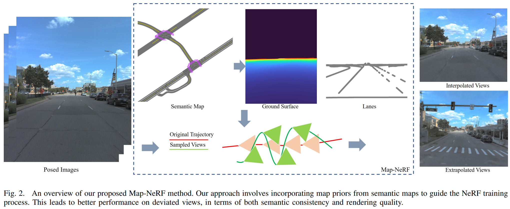</div>
    </details>

    [](https://arxiv.org/abs/2307.14981) [](https://www.youtube.com/watch?v=jEQWr-Rfh3A&feature=youtu.be)

- **RoMe: Towards Large Scale Road Surface Reconstruction via Mesh Representation**.
    <details span>
    <summary>Abstract</summary>
    In autonomous driving applications, accurate and efficient road surface reconstruction is paramount. This paper introduces RoMe, a novel framework designed for the robust reconstruction of large-scale road surfaces. Leveraging a unique mesh representation, RoMe ensures that the reconstructed road surfaces are accurate and seamlessly aligned with semantics. To address challenges in computational efficiency, we propose a waypoint sampling strategy, enabling RoMe to reconstruct vast environments by focusing on sub-areas and subsequently merging them. Furthermore, we incorporate an extrinsic optimization module to enhance the robustness against inaccuracies in extrinsic calibration. Our extensive evaluations of both public datasets and wild data underscore RoMe's superiority in terms of speed, accuracy, and robustness. For instance, it costs only 2 GPU hours to recover a road surface of 600*600 square meters from thousands of images. Notably, RoMe's capability extends beyond mere reconstruction, offering significant value for auto-labeling tasks in autonomous driving applications. 

    <div align=center>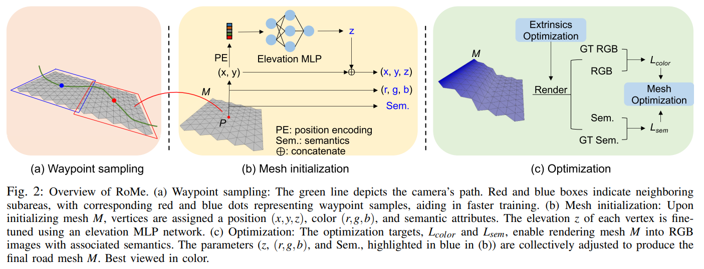</div>
    </details>

    [](https://arxiv.org/abs/2306.11368) [](https://github.com/DRosemei/RoMe)

- **S-NeRF: Neural Radiance Fields for Street Views**.
    <details span>
    <summary>Abstract</summary>
    Neural Radiance Fields (NeRFs) aim to synthesize novel views of objects and scenes, given the object-centric camera views with large overlaps. However, we conjugate that this paradigm does not fit the nature of the street views that are collected by many self-driving cars from the large-scale unbounded scenes. Also, the onboard cameras perceive scenes without much overlapping. Thus, existing NeRFs often produce blurs, 'floaters' and other artifacts on street-view synthesis. In this paper, we propose a new street-view NeRF (S-NeRF) that considers novel view synthesis of both the large-scale background scenes and the foreground moving vehicles jointly. Specifically, we improve the scene parameterization function and the camera poses for learning better neural representations from street views. We also use the the noisy and sparse LiDAR points to boost the training and learn a robust geometry and reprojection based confidence to address the depth outliers. Moreover, we extend our S-NeRF for reconstructing moving vehicles that is impracticable for conventional NeRFs. Thorough experiments on the large-scale driving datasets (e.g., nuScenes and Waymo) demonstrate that our method beats the state-of-the-art rivals by reducing 7% to 40% of the mean-squared error in the street-view synthesis and a 45% PSNR gain for the moving vehicles rendering.

    <div align=center>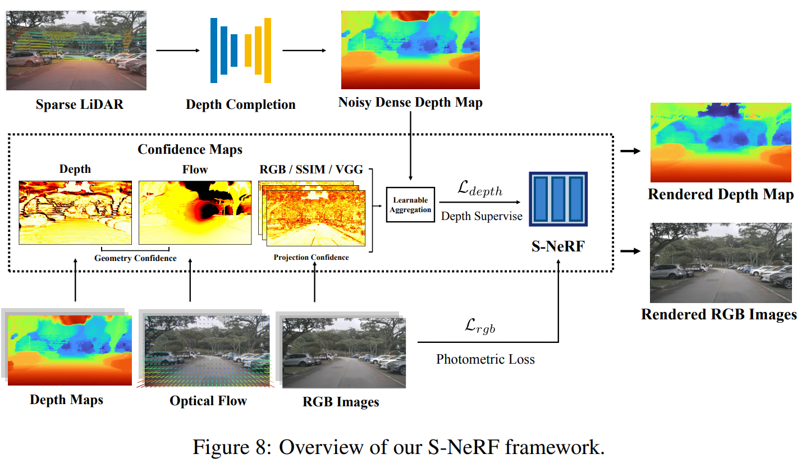</div>
    </details>

    [](https://arxiv.org/abs/2303.00749) [](https://ziyang-xie.github.io/s-nerf) [](https://github.com/fudan-zvg/S-NeRF)

- **LiDAR-NeRF: Novel LiDAR View Synthesis via Neural Radiance Fields**.
    <details span>
    <summary>Abstract</summary>
    We introduce a new task, novel view synthesis for LiDAR sensors. While traditional model-based LiDAR simulators with style-transfer neural networks can be applied to render novel views, they fall short of producing accurate and realistic LiDAR patterns because the renderers rely on explicit 3D reconstruction and exploit game engines, that ignore important attributes of LiDAR points. We address this challenge by formulating, to the best of our knowledge, the first differentiable end-to-end LiDAR rendering framework, LiDAR-NeRF, leveraging a neural radiance field (NeRF) to facilitate the joint learning of geometry and the attributes of 3D points. However, simply employing NeRF cannot achieve satisfactory results, as it only focuses on learning individual pixels while ignoring local information, especially at low texture areas, resulting in poor geometry. To this end, we have taken steps to address this issue by introducing a structural regularization method to preserve local structural details. To evaluate the effectiveness of our approach, we establish an object-centric multi-view LiDAR dataset, dubbed NeRF-MVL. It contains observations of objects from 9 categories seen from 360-degree viewpoints captured with multiple LiDAR sensors. Our extensive experiments on the scene-level KITTI-360 dataset, and on our object-level NeRF-MVL show that our LiDAR-NeRF surpasses the model-based algorithms significantly.

    <div align=center>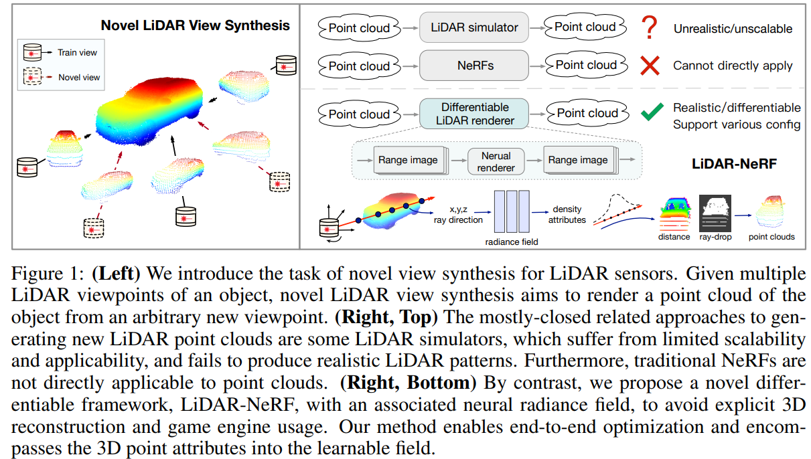</div>
    </details>

    [](https://arxiv.org/abs/2304.10406) [](https://tangtaogo.github.io/lidar-nerf-website/) [](https://github.com/tangtaogo/lidar-nerf)

- **READ: Large-Scale Neural Scene Rendering for Autonomous Driving**.
    <details span>
    <summary>Abstract</summary>
    Synthesizing free-view photo-realistic images is an important task in multimedia. With the development of advanced driver assistance systems~(ADAS) and their applications in autonomous vehicles, experimenting with different scenarios becomes a challenge. Although the photo-realistic street scenes can be synthesized by image-to-image translation methods, which cannot produce coherent scenes due to the lack of 3D information. In this paper, a large-scale neural rendering method is proposed to synthesize the autonomous driving scene~(READ), which makes it possible to synthesize large-scale driving scenarios on a PC through a variety of sampling schemes. In order to represent driving scenarios, we propose an {\omega} rendering network to learn neural descriptors from sparse point clouds. Our model can not only synthesize realistic driving scenes but also stitch and edit driving scenes. Experiments show that our model performs well in large-scale driving scenarios.

    <div align=center>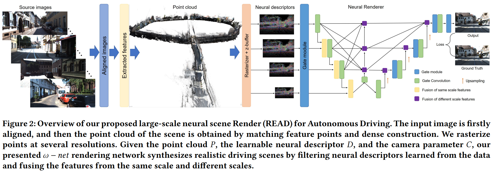</div>
    </details>

    [](https://arxiv.org/abs/2205.05509) [](https://github.com/JOP-Lee/READ)


👆 [Back to Top](#Table-of-Content)

### 3D Gaussian Splatting
- **Street Gaussians for Modeling Dynamic Urban Scenes**.
    <details span>
    <summary>Abstract</summary>
    This paper aims to tackle the problem of modeling dynamic urban street scenes from monocular videos. Recent methods extend NeRF by incorporating tracked vehicle poses to animate vehicles, enabling photo-realistic view synthesis of dynamic urban street scenes. However, significant limitations are their slow training and rendering speed, coupled with the critical need for high precision in tracked vehicle poses. We introduce Street Gaussians, a new explicit scene representation that tackles all these limitations. Specifically, the dynamic urban street is represented as a set of point clouds equipped with semantic logits and 3D Gaussians, each associated with either a foreground vehicle or the background. To model the dynamics of foreground object vehicles, each object point cloud is optimized with optimizable tracked poses, along with a dynamic spherical harmonics model for the dynamic appearance. The explicit representation allows easy composition of object vehicles and background, which in turn allows for scene editing operations and rendering at 133 FPS (1066×1600 resolution) within half an hour of training. The proposed method is evaluated on multiple challenging benchmarks, including KITTI and Waymo Open datasets. Experiments show that the proposed method consistently outperforms state-of-the-art methods across all datasets. Furthermore, the proposed representation delivers performance on par with that achieved using precise ground-truth poses, despite relying only on poses from an off-the-shelf tracker. 

    <div align=center>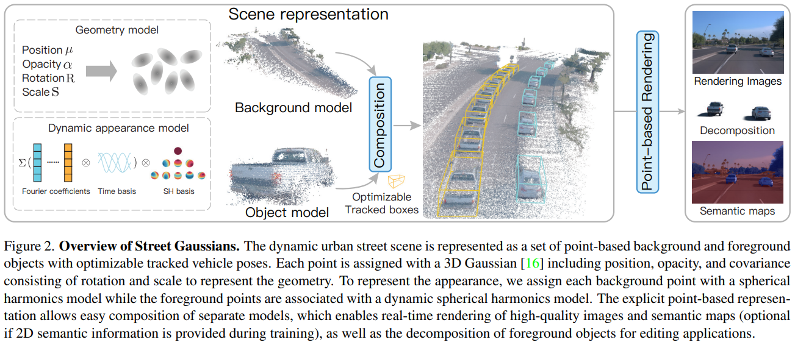</div>
    </details>

    [](https://arxiv.org/abs/2401.01339) [](https://zju3dv.github.io/street_gaussians/) [](https://github.com/zju3dv/street_gaussians)

- **DrivingGaussian: Composite Gaussian Splatting for Surrounding Dynamic Autonomous Driving Scenes**.
    <details span>
    <summary>Abstract</summary>
    We present DrivingGaussian, an efficient and effective framework for surrounding dynamic autonomous driving scenes. For complex scenes with moving objects, we first sequentially and progressively model the static background of the entire scene with incremental static 3D Gaussians. We then leverage a composite dynamic Gaussian graph to handle multiple moving objects, individually reconstructing each object and restoring their accurate positions and occlusion relationships within the scene. We further use a LiDAR prior for Gaussian Splatting to reconstruct scenes with greater details and maintain panoramic consistency. DrivingGaussian outperforms existing methods in driving scene reconstruction and enables photorealistic surround-view synthesis with high-fidelity and multi-camera consistency.

    <div align=center></div>
    </details>

    [](https://arxiv.org/abs/2312.07920) [](https://pkuvdig.github.io/DrivingGaussian/)

- **Periodic Vibration Gaussian: Dynamic Urban Scene Reconstruction and Real-time Rendering**.
    <details span>
    <summary>Abstract</summary>
    Modeling dynamic, large-scale urban scenes is challenging due to their highly intricate geometric structures and unconstrained dynamics in both space and time. Prior methods often employ high-level architectural priors, separating static and dynamic elements, resulting in suboptimal capture of their synergistic interactions. To address this challenge, we present a unified representation model, called Periodic Vibration Gaussian (PVG). PVG builds upon the efficient 3D Gaussian splatting technique, originally designed for static scene representation, by introducing periodic vibration-based temporal dynamics. This innovation enables PVG to elegantly and uniformly represent the characteristics of various objects and elements in dynamic urban scenes. To enhance temporally coherent representation learning with sparse training data, we introduce a novel flow-based temporal smoothing mechanism and a position-aware adaptive control strategy. Extensive experiments on Waymo Open Dataset and KITTI benchmarks demonstrate that PVG surpasses state-of-the-art alternatives in both reconstruction and novel view synthesis for both dynamic and static scenes. Notably, PVG achieves this without relying on manually labeled object bounding boxes or expensive optical flow estimation. Moreover, PVG exhibits 50/6000-fold acceleration in training/rendering over the best alternative.

    <div align=center>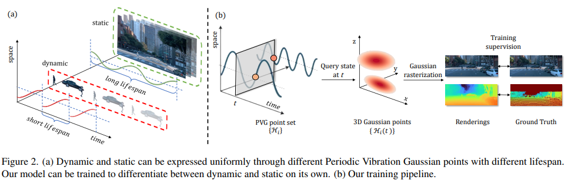</div>
    </details>

    [](https://arxiv.org/abs/2311.18561) [](https://fudan-zvg.github.io/PVG/)

👆 [Back to Top](#Table-of-Content)

## Self-supervised Training
### Contrastive
A survey paper of contrastive-based self-supervised learning: [A survey on contrastive self-supervised learning](https://arxiv.org/abs/2011.00362).

- **BEVContrast: Self-Supervision in BEV Space for Automotive Lidar Point Clouds**.
    <details span>
    <summary>Abstract</summary>
    We present a surprisingly simple and efficient method for self-supervision of 3D backbone on automotive Lidar point clouds. We design a contrastive loss between features of Lidar scans captured in the same scene. Several such approaches have been proposed in the literature from PointConstrast [40 ], which uses a contrast at the level of points, to the state-of-the-art TARL [30 ], which uses a contrast at the level of segments, roughly corresponding to objects. While the former enjoys a great simplicity of implementation, it is surpassed by the latter, which however requires a costly pre-processing. In BEVContrast, we define our contrast at the level of 2D cells in the Bird's Eye View plane. Resulting cell-level representations offer a good trade-off between the point-level representations exploited in PointContrast and segment-level representations exploited in TARL: we retain the simplicity of PointContrast (cell representations are cheap to compute) while surpassing the performance of TARL in downstream semantic segmentation.

    <div align=center>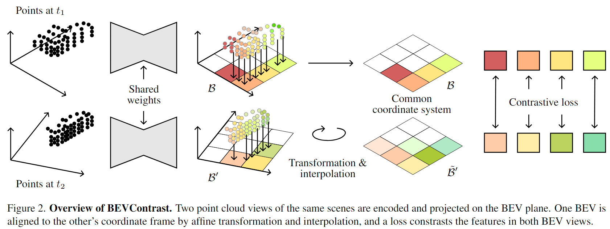</div>
    </details>

    [](https://arxiv.org/abs/2310.17281) [](https://github.com/valeoai/BEVContrast)

- **AD-PT: Autonomous Driving Pre-Training with Large-scale Point Cloud Dataset**.
    <details span>
    <summary>Abstract</summary>
    It is a long-term vision for Autonomous Driving (AD) community that the perception models can learn from a large-scale point cloud dataset, to obtain unified representations that can achieve promising results on different tasks or benchmarks. Previous works mainly focus on the self-supervised pre-training pipeline, meaning that they perform the pre-training and fine-tuning on the same benchmark, which is difficult to attain the performance scalability and cross-dataset application for the pre-training checkpoint. In this paper, for the first time, we are committed to building a large-scale pre-training point-cloud dataset with diverse data distribution, and meanwhile learning generalizable representations from such a diverse pre-training dataset. We formulate the point-cloud pre-training task as a semi-supervised problem, which leverages the few-shot labeled and massive unlabeled point-cloud data to generate the unified backbone representations that can be directly applied to many baseline models and benchmarks, decoupling the AD-related pre-training process and downstream fine-tuning task. During the period of backbone pre-training, by enhancing the scene- and instance-level distribution diversity and exploiting the backbone's ability to learn from unknown instances, we achieve significant performance gains on a series of downstream perception benchmarks including Waymo, nuScenes, and KITTI, under different baseline models like PV-RCNN++, SECOND, CenterPoint.

    <div align=center>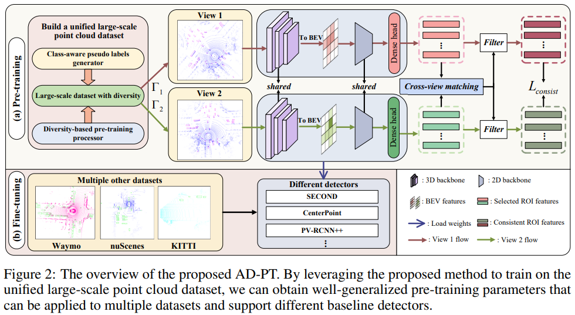</div>
    </details>

    [](https://arxiv.org/abs/2306.00612) [](https://jiakangyuan.github.io/AD-PT.github.io/) [](https://github.com/PJLab-ADG/3DTrans)

- **SegContrast: 3D Point Cloud Feature Representation Learning Through Self-Supervised Segment Discrimination**.
    <details span>
    <summary>Abstract</summary>
    Semantic scene interpretation is essential for autonomous systems to operate in complex scenarios. While deep learning-based methods excel at this task, they rely on vast amounts of labeled data that is tedious to generate and might not cover all relevant classes sufficiently. Self-supervised representation learning has the prospect of reducing the amount of required labeled data by learning descriptive representations from unlabeled data. In this letter, we address the problem of representation learning for 3D point cloud data in the context of autonomous driving. We propose a new contrastive learning approach that aims at learning the structural context of the scene. Our approach extracts class-agnostic segments over the point cloud and applies the contrastive loss over these segments to discriminate between similar and dissimilar structures. We apply our method on data recorded with a 3D LiDAR. We show that our method achieves competitive performance and can learn a more descriptive feature representation than other state-of-the-art self-supervised contrastive point cloud methods.

    <div align=center>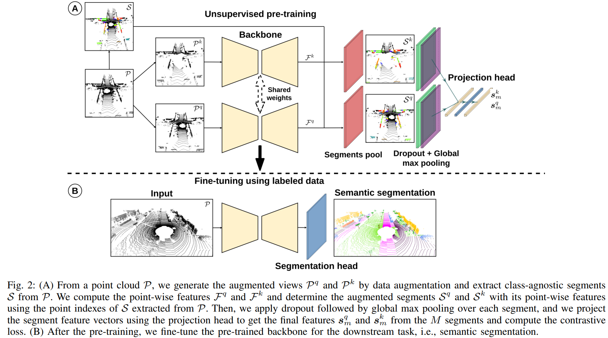</div>
    </details>

    [](https://www.ipb.uni-bonn.de/pdfs/nunes2022ral-icra.pdf) [](https://github.com/PRBonn/segcontrast)

- **Temporal Consistent 3D LiDAR Representation Learning for Semantic Perception in Autonomous Driving**.
    <details span>
    <summary>Abstract</summary>
    Semantic perception is a core building block in autonomous driving, since it provides information about the drivable space and location of other traffic participants. For learning-based perception, often a large amount of diverse training data is necessary to achieve high performance. Data labeling is usually a bottleneck for developing such methods, especially for dense prediction tasks, e.g., semantic segmentation or panoptic segmentation. For 3D LiDAR data, the annotation process demands even more effort than for images. Especially in autonomous driving, point clouds are sparse, and objects appearance depends on its distance from the sensor, making it harder to acquire large amounts of labeled training data. This paper aims at taking an alternative path proposing a self-supervised representation learning method for 3D LiDAR data. Our approach exploits the vehicle motion to match objects across time viewed in different scans. We then train a model to maximize the point-wise feature similarities from points of the associated object in different scans, which enables to learn a consistent representation across time. The experimental results show that our approach performs better than previous state-of-the-art self-supervised representation learning methods when fine-tuning to different downstream tasks. We furthermore show that with only 10% of labeled data, a network pre-trained with our approach can achieve better performance than the same network trained from scratch with all labels for semantic segmentation on SemanticKITTI.

    <div align=center>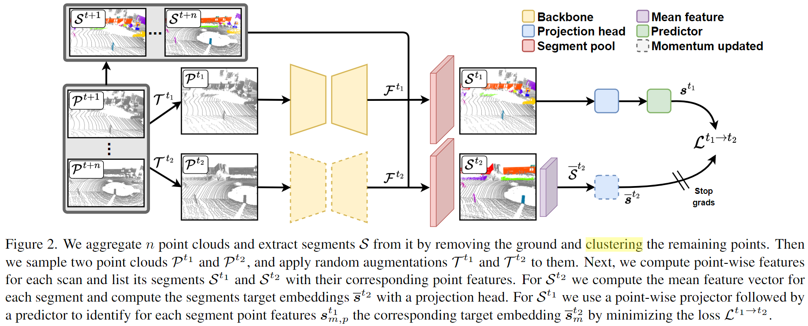</div>
    </details>

    [](https://openaccess.thecvf.com/content/CVPR2023/html/Nunes_Temporal_Consistent_3D_LiDAR_Representation_Learning_for_Semantic_Perception_in_CVPR_2023_paper.html)  [](https://github.com/PRBonn/TARL)

- **SimIPU: Simple 2D Image and 3D Point Cloud Unsupervised Pre-Training for Spatial-Aware Visual Representations**.
    <details span>
    <summary>Abstract</summary>
    Pre-training has become a standard paradigm in many computer vision tasks. However, most of the methods are generally designed on the RGB image domain. Due to the discrepancy between the two-dimensional image plane and the three-dimensional space, such pre-trained models fail to perceive spatial information and serve as sub-optimal solutions for 3D-related tasks. To bridge this gap, we aim to learn a spatial-aware visual representation that can describe the three-dimensional space and is more suitable and effective for these tasks. To leverage point clouds, which are much more superior in providing spatial information compared to images, we propose a simple yet effective 2D Image and 3D Point cloud Unsupervised pre-training strategy, called SimIPU. Specifically, we develop a multi-modal contrastive learning framework that consists of an intra-modal spatial perception module to learn a spatial-aware representation from point clouds and an inter-modal feature interaction module to transfer the capability of perceiving spatial information from the point cloud encoder to the image encoder, respectively. Positive pairs for contrastive losses are established by the matching algorithm and the projection matrix. The whole framework is trained in an unsupervised end-to-end fashion. To the best of our knowledge, this is the first study to explore contrastive learning pre-training strategies for outdoor multi-modal datasets, containing paired camera images and LIDAR point clouds.

    <div align=center>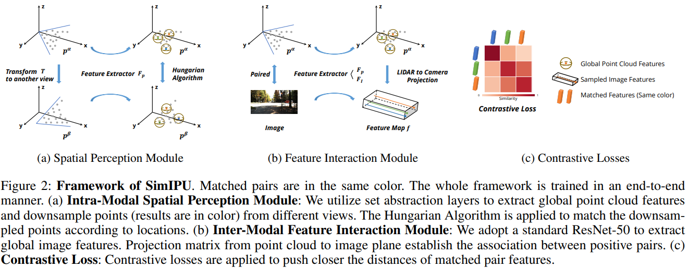</div>
    </details>

    [](https://arxiv.org/abs/2112.04680) [](https://github.com/zhyever/SimIPU)

- **Self-Supervised Pretraining of 3D Features on any Point-Cloud**.
    <details span>
    <summary>Abstract</summary>
    Pretraining on large labeled datasets is a prerequisite to achieve good performance in many computer vision tasks like 2D object recognition, video classification etc. However, pretraining is not widely used for 3D recognition tasks where state-of-the-art methods train models from scratch. A primary reason is the lack of large annotated datasets because 3D data is both difficult to acquire and time consuming to label. We present a simple self-supervised pertaining method that can work with any 3D data - single or multiview, indoor or outdoor, acquired by varied sensors, without 3D registration. We pretrain standard point cloud and voxel based model architectures, and show that joint pretraining further improves performance. We evaluate our models on 9 benchmarks for object detection, semantic segmentation, and object classification, where they achieve state-of-the-art results and can outperform supervised pretraining. We set a new state-of-the-art for object detection on ScanNet (69.0% mAP) and SUNRGBD (63.5% mAP).

    <div align=center>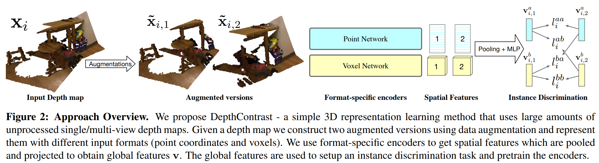</div>
    </details>

    [](https://arxiv.org/abs/2101.02691) [](https://github.com/facebookresearch/DepthContrast)

- **PointContrast: Unsupervised Pre-training for 3D Point Cloud Understanding**.
    <details span>
    <summary>Abstract</summary>
    Arguably one of the top success stories of deep learning is transfer learning. The finding that pre-training a network on a rich source set (e.g., ImageNet) can help boost performance once fine-tuned on a usually much smaller target set, has been instrumental to many applications in language and vision. Yet, very little is known about its usefulness in 3D point cloud understanding. We see this as an opportunity considering the effort required for annotating data in 3D. In this work, we aim at facilitating research on 3D representation learning. Different from previous works, we focus on high-level scene understanding tasks. To this end, we select a suite of diverse datasets and tasks to measure the effect of unsupervised pre-training on a large source set of 3D scenes. Our findings are extremely encouraging: using a unified triplet of architecture, source dataset, and contrastive loss for pre-training, we achieve improvement over recent best results in segmentation and detection across 6 different benchmarks for indoor and outdoor, real and synthetic datasets – demonstrating that the learned representation can generalize across domains. Furthermore, the improvement was similar to supervised pre-training, suggesting that future efforts should favor scaling data collection over more detailed annotation. We hope these findings will encourage more research on unsupervised pretext task design for 3D deep learning.

    <div align=center>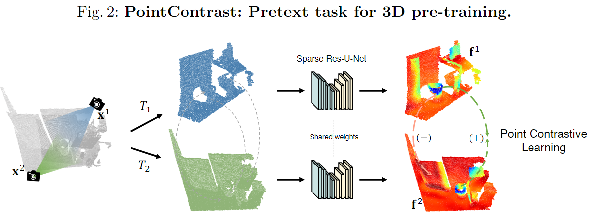</div>
    </details>

    [](https://arxiv.org/abs/2007.10985) [](https://github.com/facebookresearch/PointContrast)

👆 [Back to Top](#Table-of-Content)

### Reconstruction

- **Voxel-MAE - Masked Autoencoders for Self-Supervised Learning on Automotive Point Clouds**.
    <details span>
    <summary>Abstract</summary>
    Masked autoencoding has become a successful pretraining paradigm for Transformer models for text, images, and, recently, point clouds. Raw automotive datasets are suitable candidates for self-supervised pre-training as they generally are cheap to collect compared to annotations for tasks like 3D object detection (OD). However, the development of masked autoencoders for point clouds has focused solely on synthetic and indoor data. Consequently, existing methods have tailored their representations and models toward small and dense point clouds with homogeneous point densities. In this work, we study masked autoencoding for point clouds in an automotive setting, which are sparse and for which the point density can vary drastically among objects in the same scene. To this end, we propose Voxel-MAE, a simple masked autoencoding pre-training scheme designed for voxel representations. We pre-train the backbone of a Transformer-based 3D object detector to reconstruct masked voxels and to distinguish between empty and non-empty voxels. Our method improves the 3D OD performance by 1.75 mAP points and 1.05 NDS on the challenging nuScenes dataset. Further, we show that by pre-training with Voxel-MAE, we require only 40% of the annotated data to outperform a randomly initialized equivalent.

    <div align=center>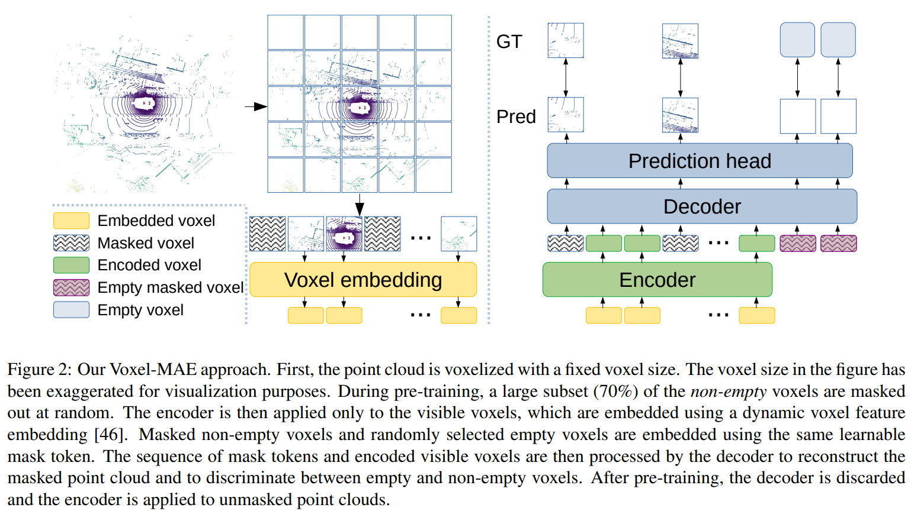</div>
    </details>

    [](https://arxiv.org/abs/2207.00531) [](https://georghess.se/projects/voxel-mae/) [](https://github.com/georghess/voxel-mae)

- **GD-MAE: Generative Decoder for MAE Pre-training on LiDAR Point Clouds**.
    <details span>
    <summary>Abstract</summary>
    Despite the tremendous progress of Masked Autoencoders (MAE) in developing vision tasks such as image and video, exploring MAE in large-scale 3D point clouds remains challenging due to the inherent irregularity. In contrast to previous 3D MAE frameworks, which either design a complex decoder to infer masked information from maintained regions or adopt sophisticated masking strategies, we instead propose a much simpler paradigm. The core idea is to apply a \textbf{G}enerative \textbf{D}ecoder for MAE (GD-MAE) to automatically merges the surrounding context to restore the masked geometric knowledge in a hierarchical fusion manner. In doing so, our approach is free from introducing the heuristic design of decoders and enjoys the flexibility of exploring various masking strategies. The corresponding part costs less than \textbf{12\%} latency compared with conventional methods, while achieving better performance. We demonstrate the efficacy of the proposed method on several large-scale benchmarks: Waymo, KITTI, and ONCE. Consistent improvement on downstream detection tasks illustrates strong robustness and generalization capability. Not only our method reveals state-of-the-art results, but remarkably, we achieve comparable accuracy even with \textbf{20\%} of the labeled data on the Waymo dataset.

    <div align=center>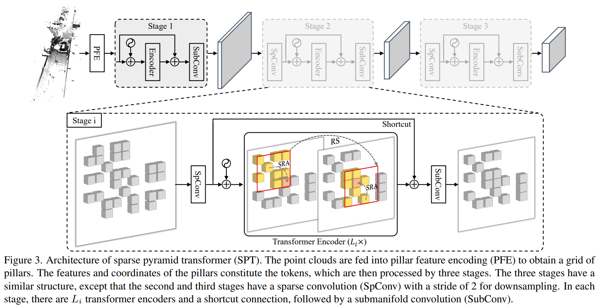</div>
    </details>

    [](https://arxiv.org/abs/2212.03010) [](https://github.com/Nightmare-n/GD-MAE)

- **UniM2AE: Multi-modal Masked Autoencoders with Unified 3D Representation for 3D Perception in Autonomous Driving**.
    <details span>
    <summary>Abstract</summary>
    Masked Autoencoders (MAE) play a pivotal role in learning potent representations, delivering outstanding results across various 3D perception tasks essential for autonomous driving. In real-world driving scenarios, it's commonplace to deploy multiple sensors for comprehensive environment perception. While integrating multi-modal features from these sensors can produce rich and powerful features, there is a noticeable gap in MAE methods addressing this integration. This research delves into multi-modal Masked Autoencoders tailored for a unified representation space in autonomous driving, aiming to pioneer a more efficient fusion of two distinct modalities. To intricately marry the semantics inherent in images with the geometric intricacies of LiDAR point clouds, the UniM$^2$AE is proposed. This model stands as a potent yet straightforward, multi-modal self-supervised pre-training framework, mainly consisting of two designs. First, it projects the features from both modalities into a cohesive 3D volume space, ingeniously expanded from the bird's eye view (BEV) to include the height dimension. The extension makes it possible to back-project the informative features, obtained by fusing features from both modalities, into their native modalities to reconstruct the multiple masked inputs. Second, the Multi-modal 3D Interactive Module (MMIM) is invoked to facilitate the efficient inter-modal interaction during the interaction process. Extensive experiments conducted on the nuScenes Dataset attest to the efficacy of UniM$^2$AE, indicating enhancements in 3D object detection and BEV map segmentation by 1.2\%(NDS) and 6.5\% (mIoU), respectively.

    <div align=center>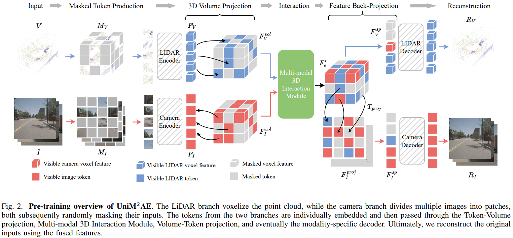</div>
    </details>

    [](https://arxiv.org/abs/2308.10421) [](https://github.com/hollow-503/UniM2AE)


- **UniScene: Multi-Camera Unified Pre-training via 3D Scene Reconstruction**.
    <details span>
    <summary>Abstract</summary>
    Multi-camera 3D perception has emerged as a prominent research field in autonomous driving, offering a viable and cost-effective alternative to LiDAR-based solutions. The existing multi-camera algorithms primarily rely on monocular 2D pre-training. However, the monocular 2D pre-training overlooks the spatial and temporal correlations among the multi-camera system. To address this limitation, we propose the first multi-camera unified pre-training framework, called UniScene, which involves initially reconstructing the 3D scene as the foundational stage and subsequently fine-tuning the model on downstream tasks. Specifically, we employ Occupancy as the general representation for the 3D scene, enabling the model to grasp geometric priors of the surrounding world through pre-training. A significant benefit of UniScene is its capability to utilize a considerable volume of unlabeled image-LiDAR pairs for pre-training purposes. The proposed multi-camera unified pre-training framework demonstrates promising results in key tasks such as multi-camera 3D object detection and surrounding semantic scene completion. When compared to monocular pre-training methods on the nuScenes dataset, UniScene shows a significant improvement of about 2.0% in mAP and 2.0% in NDS for multi-camera 3D object detection, as well as a 3% increase in mIoU for surrounding semantic scene completion. By adopting our unified pre-training method, a 25% reduction in 3D training annotation costs can be achieved, offering significant practical value for the implementation of real-world autonomous driving.

    <div align=center>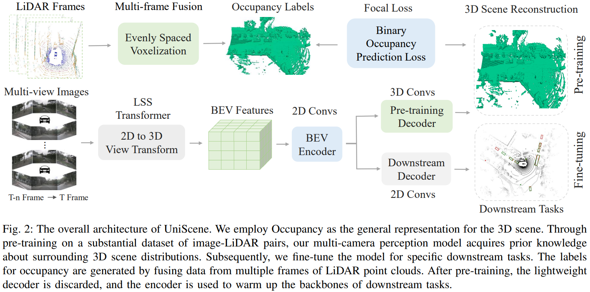</div>
    </details>

    [](https://arxiv.org/abs/2305.18829) [](https://github.com/chaytonmin/UniScene)

- **Occupancy-MAE: Self-supervised Pre-training Large-scale LiDAR Point Clouds with Masked Occupancy Autoencoders**.
    <details span>
    <summary>Abstract</summary>
    Current perception models in autonomous driving heavily rely on large-scale labelled 3D data, which is both costly and time-consuming to annotate. This work proposes a solution to reduce the dependence on labelled 3D training data by leveraging pre-training on large-scale unlabeled outdoor LiDAR point clouds using masked autoencoders (MAE). While existing masked point autoencoding methods mainly focus on small-scale indoor point clouds or pillar-based large-scale outdoor LiDAR data, our approach introduces a new self-supervised masked occupancy pre-training method called Occupancy-MAE, specifically designed for voxel-based large-scale outdoor LiDAR point clouds. Occupancy-MAE takes advantage of the gradually sparse voxel occupancy structure of outdoor LiDAR point clouds and incorporates a range-aware random masking strategy and a pretext task of occupancy prediction. By randomly masking voxels based on their distance to the LiDAR and predicting the masked occupancy structure of the entire 3D surrounding scene, Occupancy-MAE encourages the extraction of high-level semantic information to reconstruct the masked voxel using only a small number of visible voxels. Extensive experiments demonstrate the effectiveness of Occupancy-MAE across several downstream tasks. For 3D object detection, Occupancy-MAE reduces the labelled data required for car detection on the KITTI dataset by half and improves small object detection by approximately 2% in AP on the Waymo dataset. For 3D semantic segmentation, Occupancy-MAE outperforms training from scratch by around 2% in mIoU. For multi-object tracking, Occupancy-MAE enhances training from scratch by approximately 1% in terms of AMOTA and AMOTP.

    <div align=center>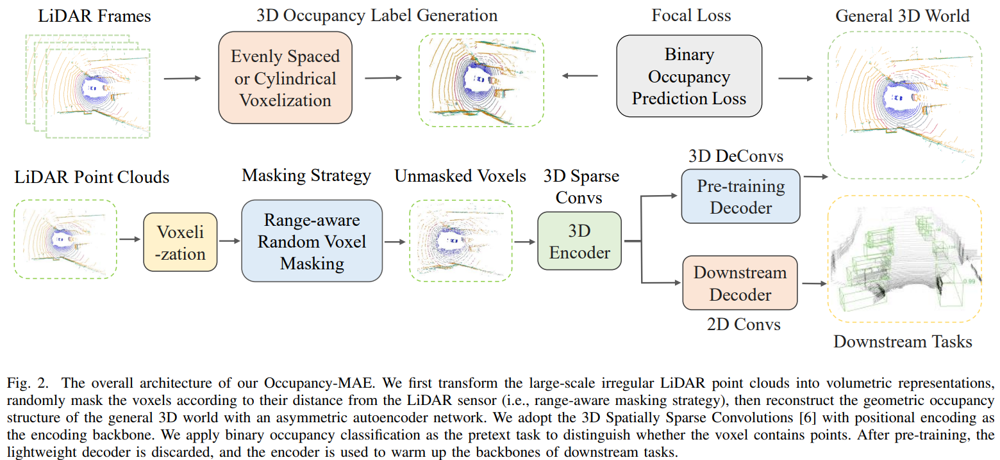</div>
    </details>

    [](https://arxiv.org/abs/2206.09900) [](https://github.com/chaytonmin/Occupancy-MAE)

- **Implicit Autoencoder for Point-Cloud Self-Supervised Representation Learning**.
    <details span>
    <summary>Abstract</summary>
    This paper advocates the use of implicit surface representation in autoencoder-based self-supervised 3D representation learning. The most popular and accessible 3D representation, i.e., point clouds, involves discrete samples of the underlying continuous 3D surface. This discretization process introduces sampling variations on the 3D shape, making it challenging to develop transferable knowledge of the true 3D geometry. In the standard autoencoding paradigm, the encoder is compelled to encode not only the 3D geometry but also information on the specific discrete sampling of the 3D shape into the latent code. This is because the point cloud reconstructed by the decoder is considered unacceptable unless there is a perfect mapping between the original and the reconstructed point clouds. This paper introduces the Implicit AutoEncoder (IAE), a simple yet effective method that addresses the sampling variation issue by replacing the commonly-used point-cloud decoder with an implicit decoder. The implicit decoder reconstructs a continuous representation of the 3D shape, independent of the imperfections in the discrete samples. Extensive experiments demonstrate that the proposed IAE achieves state-of-the-art performance across various self-supervised learning benchmarks.

    <div align=center>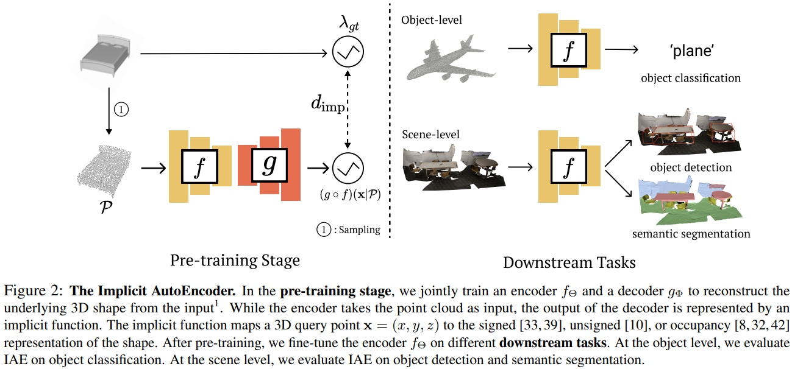</div>
    </details>

    [](https://arxiv.org/abs/2201.00785) [](https://github.com/SimingYan/IAE)

- **BEV-MAE: Bird's Eye View Masked Autoencoders for Outdoor Point Cloud Pre-training**.
    <details span>
    <summary>Abstract</summary>
    Current outdoor LiDAR-based 3D object detection methods mainly adopt the training-from-scratch paradigm. Unfortunately, this paradigm heavily relies on large-scale labeled data, whose collection can be expensive and time-consuming. Self-supervised pre-training is an effective and desirable way to alleviate this dependence on extensive annotated data. Recently, masked modeling has become a successful self-supervised learning approach for point clouds. However, current works mainly focus on synthetic or indoor datasets. When applied to large-scale and sparse outdoor point clouds, they fail to yield satisfactory results. In this work, we present BEV-MAE, a simple masked autoencoder pre-training framework for 3D object detection on outdoor point clouds. Specifically, we first propose a bird's eye view (BEV) guided masking strategy to guide the 3D encoder learning feature representation in a BEV perspective and avoid complex decoder design during pre-training. Besides, we introduce a learnable point token to maintain a consistent receptive field size of the 3D encoder with fine-tuning for masked point cloud inputs. Finally, based on the property of outdoor point clouds, i.e., the point clouds of distant objects are more sparse, we propose point density prediction to enable the 3D encoder to learn location information, which is essential for object detection. Experimental results show that BEV-MAE achieves new state-of-the-art self-supervised results on both Waymo and nuScenes with diverse 3D object detectors. Furthermore, with only 20% data and 7% training cost during pre-training, BEV-MAE achieves comparable performance with the state-of-the-art method ProposalContrast. 

    <div align=center>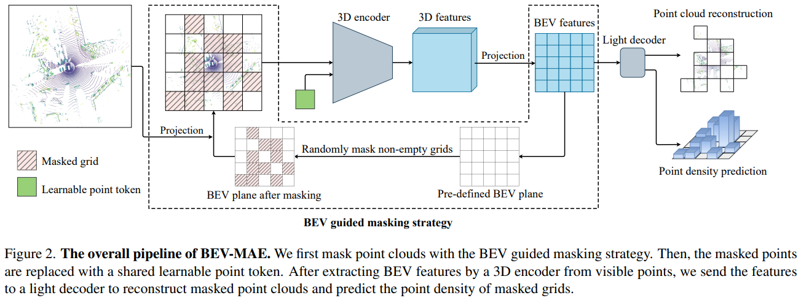</div>
    </details>

    [](https://arxiv.org/abs/2212.05758)


- **MAELi: Masked Autoencoder for Large-Scale LiDAR Point Clouds**.
    <details span>
    <summary>Abstract</summary>
    The sensing process of large-scale LiDAR point clouds inevitably causes large blind spots, i.e. regions not visible to the sensor. We demonstrate how these inherent sampling properties can be effectively utilized for self-supervised representation learning by designing a highly effective pre-training framework that considerably reduces the need for tedious 3D annotations to train state-of-the-art object detectors. Our Masked AutoEncoder for LiDAR point clouds (MAELi) intuitively leverages the sparsity of LiDAR point clouds in both the encoder and decoder during reconstruction. This results in more expressive and useful initialization, which can be directly applied to downstream perception tasks, such as 3D object detection or semantic segmentation for autonomous driving. In a novel reconstruction approach, MAELi distinguishes between empty and occluded space and employs a new masking strategy that targets the LiDAR's inherent spherical projection. Thereby, without any ground truth whatsoever and trained on single frames only, MAELi obtains an understanding of the underlying 3D scene geometry and semantics. To demonstrate the potential of MAELi, we pre-train backbones in an end-to-end manner and show the effectiveness of our unsupervised pre-trained weights on the tasks of 3D object detection and semantic segmentation.

    <div align=center>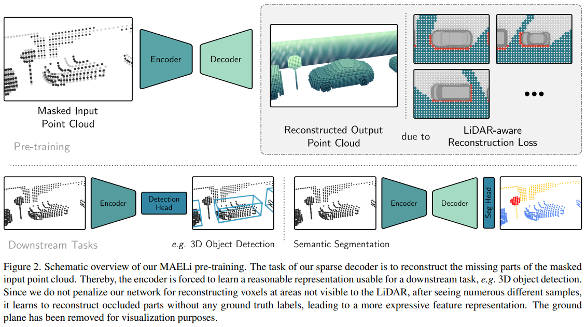</div>
    </details>

    [](https://arxiv.org/abs/2212.07207)

- **GD-MAE: Generative Decoder for MAE Pre-training on LiDAR Point Clouds**.
    <details span>
    <summary>Abstract</summary>
    Despite the tremendous progress of Masked Autoencoders (MAE) in developing vision tasks such as image and video, exploring MAE in large-scale 3D point clouds remains challenging due to the inherent irregularity. In contrast to previous 3D MAE frameworks, which either design a complex decoder to infer masked information from maintained regions or adopt sophisticated masking strategies, we instead propose a much simpler paradigm. The core idea is to apply a \textbf{G}enerative \textbf{D}ecoder for MAE (GD-MAE) to automatically merges the surrounding context to restore the masked geometric knowledge in a hierarchical fusion manner. In doing so, our approach is free from introducing the heuristic design of decoders and enjoys the flexibility of exploring various masking strategies. The corresponding part costs less than \textbf{12\%} latency compared with conventional methods, while achieving better performance. We demonstrate the efficacy of the proposed method on several large-scale benchmarks: Waymo, KITTI, and ONCE. Consistent improvement on downstream detection tasks illustrates strong robustness and generalization capability. Not only our method reveals state-of-the-art results, but remarkably, we achieve comparable accuracy even with \textbf{20\%} of the labeled data on the Waymo dataset.

    <div align=center></div>
    </details>

    [](https://arxiv.org/abs/2212.03010) [](https://github.com/Nightmare-n/GD-MAE)

- **ALSO: Automotive Lidar Self-supervision by Occupancy estimation**.
    <details span>
    <summary>Abstract</summary>
    We propose a new self-supervised method for pre-training the backbone of deep perception models operating on point clouds. The core idea is to train the model on a pretext task which is the reconstruction of the surface on which the 3D points are sampled, and to use the underlying latent vectors as input to the perception head. The intuition is that if the network is able to reconstruct the scene surface, given only sparse input points, then it probably also captures some fragments of semantic information, that can be used to boost an actual perception task. This principle has a very simple formulation, which makes it both easy to implement and widely applicable to a large range of 3D sensors and deep networks performing semantic segmentation or object detection. In fact, it supports a single-stream pipeline, as opposed to most contrastive learning approaches, allowing training on limited resources. We conducted extensive experiments on various autonomous driving datasets, involving very different kinds of lidars, for both semantic segmentation and object detection. The results show the effectiveness of our method to learn useful representations without any annotation, compared to existing approaches.

    <div align=center>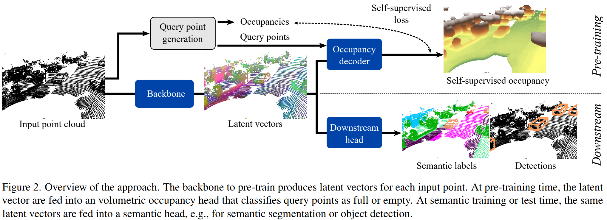</div>
    </details>

    [](https://arxiv.org/abs/2212.05867) [](https://github.com/valeoai/ALSO)

👆 [Back to Top](#Table-of-Content)


### Distillation
- **Segment Any Point Cloud Sequences by Distilling Vision Foundation Models**.
    <details span>
    <summary>Abstract</summary>
    Recent advancements in vision foundation models (VFMs) have opened up new possibilities for versatile and efficient visual perception. In this work, we introduceSeal, a novel framework that harnesses VFMs for segmenting diverse automotive point cloud sequences. Seal exhibits three appealing properties: i) Scalability:VFMs are directly distilled into point clouds, eliminating the need for annotations in either 2D or 3D during pretraining. ii) Consistency: Spatial and temporal relationships are enforced at both the camera-to-LiDAR and point-to-segment stages, facilitating cross-modal representation learning. iii) Generalizability: Seal enables knowledge transfer in an off-the-shelf manner to downstream tasks involving diverse point clouds, including those from real/synthetic, low/high-resolution, large/small-scale, and clean/corrupted datasets. Extensive experiments conducted on eleven different point cloud datasets showcase the effectiveness and superiority of Seal. Notably, Seal achieves a remarkable 45.0% mIoU on nuScenes after linear probing, surpassing random initialization by 36.9% mIoU and outperforming prior arts by 6.1% mIoU. Moreover, Seal demonstrates significant performance gains over existing methods across 20 different few-shot fine-tuning tasks on all eleven tested point cloud datasets.

    <div align=center>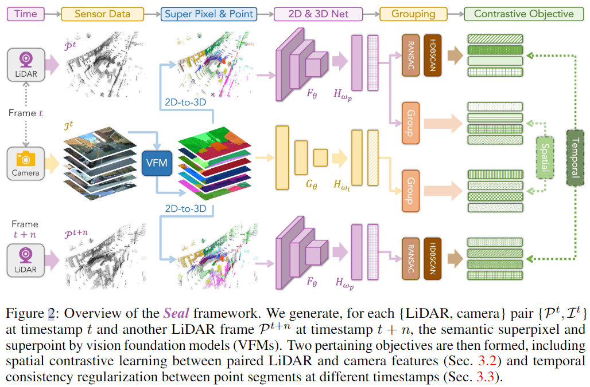</div>
    </details>

    [](https://arxiv.org/abs/2306.09347) [](https://ldkong.com/Seal) [](https://github.com/youquanl/Segment-Any-Point-Cloud)

- **Self-Supervised Image-to-Point Distillation via Semantically Tolerant Contrastive Loss**.
    <details span>
    <summary>Abstract</summary>
    An effective framework for learning 3D representations for perception tasks is distilling rich self-supervised image features via contrastive learning. However, image-to point representation learning for autonomous driving datasets faces two main challenges: 1) the abundance of self-similarity, which results in the contrastive losses pushing away semantically similar point and image regions and thus disturbing the local semantic structure of the learned representations, and 2) severe class imbalance as pretraining gets dominated by over-represented classes. We propose to alleviate the self-similarity problem through a novel semantically tolerant image-to-point contrastive loss that takes into consideration the semantic distance between positive and negative image regions to minimize contrasting semantically similar point and image regions. Additionally, we address class imbalance by designing a class-agnostic balanced loss that approximates the degree of class imbalance through an aggregate sample-to-samples semantic similarity measure. We demonstrate that our semantically-tolerant contrastive loss with class balancing improves state-of-the art 2D-to-3D representation learning in all evaluation settings on 3D semantic segmentation. Our method consistently outperforms state-of-the-art 2D-to-3D representation learning frameworks across a wide range of 2D self-supervised pretrained models.

    <div align=center>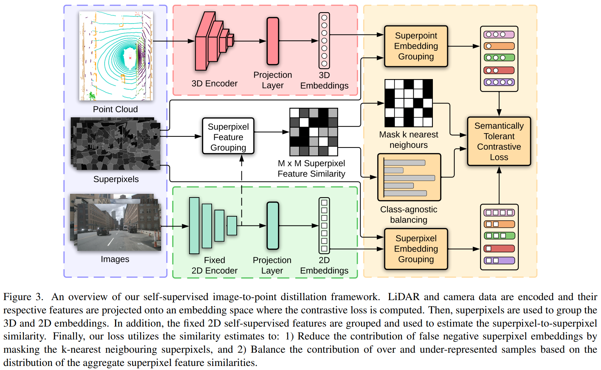</div>
    </details>

    [](https://arxiv.org/abs/2301.05709)

- **Boosting 3D Object Detection by Simulating Multimodality on Point Clouds**.
    <details span>
    <summary>Abstract</summary>
    This paper presents a new approach to boost a single-modality (LiDAR) 3D object detector by teaching it to simulate features and responses that follow a multi-modality (LiDAR-image) detector. The approach needs LiDAR-image data only when training the single-modality detector, and once well-trained, it only needs LiDAR data at inference. We design a novel framework to realize the approach: response distillation to focus on the crucial response samples and avoid the background samples; sparse-voxel distillation to learn voxel semantics and relations from the estimated crucial voxels; a fine-grained voxel-to-point distillation to better attend to features of small and distant objects; and instance distillation to further enhance the deep-feature consistency. Experimental results on the nuScenes dataset show that our approach outperforms all SOTA LiDAR-only 3D detectors and even surpasses the baseline LiDAR-image detector on the key NDS metric, filling 72% mAP gap between the single- and multi-modality detectors.

    <div align=center>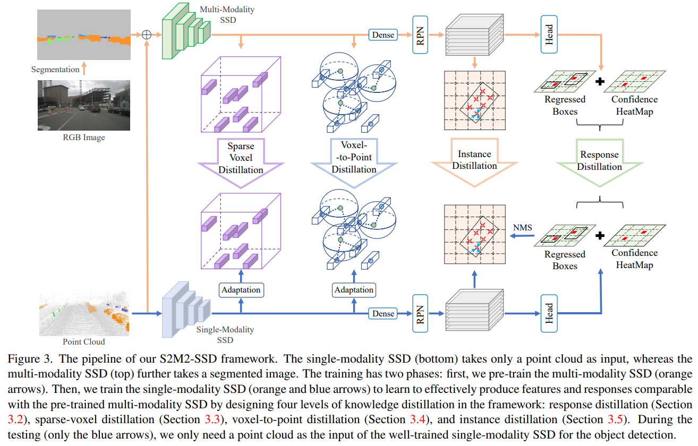</div>
    </details>

    [](https://arxiv.org/abs/2206.14971)


- **Image-to-Lidar Self-Supervised Distillation for Autonomous Driving Data**.
    <details span>
    <summary>Abstract</summary>
    Segmenting or detecting objects in sparse Lidar point clouds are two important tasks in autonomous driving to allow a vehicle to act safely in its 3D environment. The best performing methods in 3D semantic segmentation or object detection rely on a large amount of annotated data. Yet annotating 3D Lidar data for these tasks is tedious and costly. In this context, we propose a self-supervised pre-training method for 3D perception models that is tailored to autonomous driving data. Specifically, we leverage the availability of synchronized and calibrated image and Lidar sensors in autonomous driving setups for distilling self-supervised pre-trained image representations into 3D models. Hence, our method does not require any point cloud nor image annotations. The key ingredient of our method is the use of superpixels which are used to pool 3D point features and 2D pixel features in visually similar regions. We then train a 3D network on the self-supervised task of matching these pooled point features with the corresponding pooled image pixel features. The advantages of contrasting regions obtained by superpixels are that: (1) grouping together pixels and points of visually coherent regions leads to a more meaningful contrastive task that produces features well adapted to 3D semantic segmentation and 3D object detection; (2) all the different regions have the same weight in the contrastive loss regardless of the number of 3D points sampled in these regions; (3) it mitigates the noise produced by incorrect matching of points and pixels due to occlusions between the different sensors. Extensive experiments on autonomous driving datasets demonstrate the ability of our image-to-Lidar distillation strategy to produce 3D representations that transfer well on semantic segmentation and object detection tasks.

    <div align=center>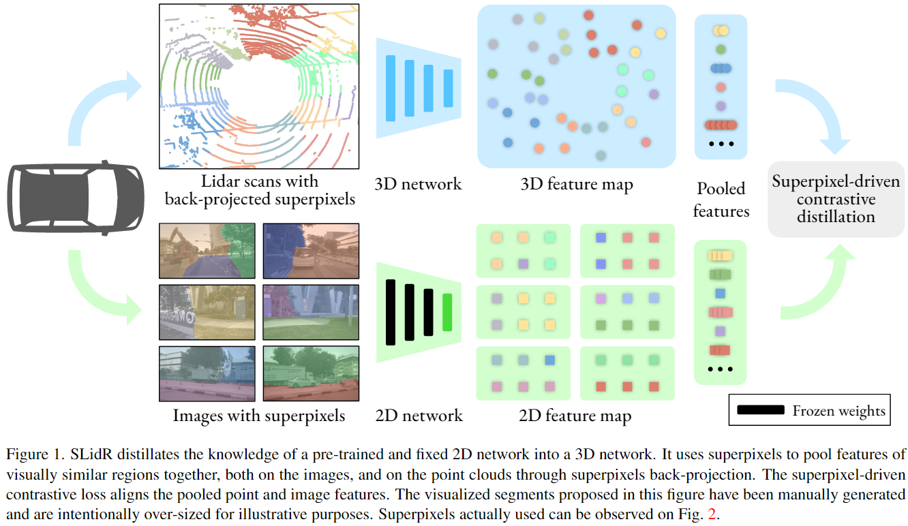</div>
    </details>

    [](https://arxiv.org/abs/2203.16258) [](https://github.com/valeoai/SLidR)


👆 [Back to Top](#Table-of-Content)


### Rendering
- **PRED: Pre-training via Semantic Rendering on LiDAR Point Clouds**.
    <details span>
    <summary>Abstract</summary>
    Pre-training is crucial in 3D-related fields such as autonomous driving where point cloud annotation is costly and challenging. Many recent studies on point cloud pre-training, however, have overlooked the issue of incompleteness, where only a fraction of the points are captured by LiDAR, leading to ambiguity during the training phase. On the other hand, images offer more comprehensive information and richer semantics that can bolster point cloud encoders in addressing the incompleteness issue inherent in point clouds. Yet, incorporating images into point cloud pre-training presents its own challenges due to occlusions, potentially causing misalignments between points and pixels. In this work, we propose PRED, a novel image-assisted pre-training framework for outdoor point clouds in an occlusion-aware manner. The main ingredient of our framework is a Birds-Eye-View (BEV) feature map conditioned semantic rendering, leveraging the semantics of images for supervision through neural rendering. We further enhance our model's performance by incorporating point-wise masking with a high mask ratio (95%). Extensive experiments demonstrate PRED's superiority over prior point cloud pre-training methods, providing significant improvements on various large-scale datasets for 3D perception tasks.

    <div align=center>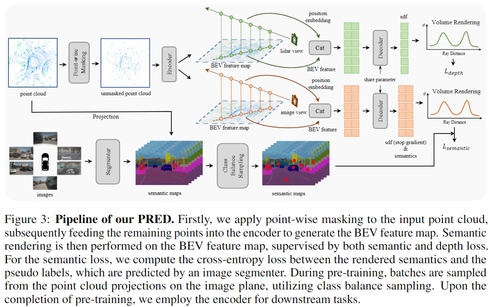</div>
    </details>

    [](https://arxiv.org/abs/2311.04501) [](https://github.com/PRED4pc/PRED)

- **SelfOcc: Self-Supervised Vision-Based 3D Occupancy Prediction**.
    <details span>
    <summary>Abstract</summary>
    3D occupancy prediction is an important task for the robustness of vision-centric autonomous driving, which aims to predict whether each point is occupied in the surrounding 3D space. Existing methods usually require 3D occupancy labels to produce meaningful results. However, it is very laborious to annotate the occupancy status of each voxel. In this paper, we propose SelfOcc to explore a self-supervised way to learn 3D occupancy using only video sequences. We first transform the images into the 3D space (e.g., bird's eye view) to obtain 3D representation of the scene. We directly impose constraints on the 3D representations by treating them as signed distance fields. We can then render 2D images of previous and future frames as self-supervision signals to learn the 3D representations. We propose an MVS-embedded strategy to directly optimize the SDF-induced weights with multiple depth proposals. Our SelfOcc outperforms the previous best method SceneRF by 58.7% using a single frame as input on SemanticKITTI and is the first self-supervised work that produces reasonable 3D occupancy for surround cameras on nuScenes. SelfOcc produces high-quality depth and achieves state-of-the-art results on novel depth synthesis, monocular depth estimation, and surround-view depth estimation on the SemanticKITTI, KITTI-2015, and nuScenes, respectively.

    <div align=center></div>
    </details>

    [](https://arxiv.org/abs/2311.12754) [](https://huang-yh.github.io/SelfOcc/) [](https://github.com/huang-yh/SelfOcc)

- **PonderV2: Pave the Way for 3D Foundation Model with A Universal Pre-training Paradigm**.
    <details span>
    <summary>Abstract</summary>
    In contrast to numerous NLP and 2D computer vision foundational models, the learning of a robust and highly generalized 3D foundational model poses considerably greater challenges. This is primarily due to the inherent data variability and the diversity of downstream tasks. In this paper, we introduce a comprehensive 3D pre-training framework designed to facilitate the acquisition of efficient 3D representations, thereby establishing a pathway to 3D foundational models. Motivated by the fact that informative 3D features should be able to encode rich geometry and appearance cues that can be utilized to render realistic images, we propose a novel universal paradigm to learn point cloud representations by differentiable neural rendering, serving as a bridge between 3D and 2D worlds. We train a point cloud encoder within a devised volumetric neural renderer by comparing the rendered images with the real images. Notably, our approach demonstrates the seamless integration of the learned 3D encoder into diverse downstream tasks. These tasks encompass not only high-level challenges such as 3D detection and segmentation but also low-level objectives like 3D reconstruction and image synthesis, spanning both indoor and outdoor scenarios. Besides, we also illustrate the capability of pre-training a 2D backbone using the proposed universal methodology, surpassing conventional pre-training methods by a large margin. For the first time, PonderV2 achieves state-of-the-art performance on 11 indoor and outdoor benchmarks. The consistent improvements in various settings imply the effectiveness of the proposed method.

    <div align=center>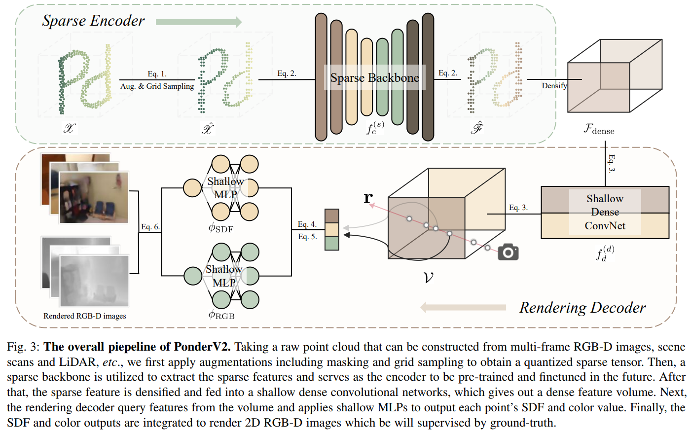</div>
    </details>

    [](https://arxiv.org/abs/2310.08586) [](https://github.com/OpenGVLab/PonderV2)

- **Ponder: Point Cloud Pre-training via Neural Rendering**.
    <details span>
    <summary>Abstract</summary>
    We propose a novel approach to self-supervised learning of point cloud representations by differentiable neural rendering. Motivated by the fact that informative point cloud features should be able to encode rich geometry and appearance cues and render realistic images, we train a point-cloud encoder within a devised point-based neural renderer by comparing the rendered images with real images on massive RGB-D data. The learned point-cloud encoder can be easily integrated into various downstream tasks, including not only high-level tasks like 3D detection and segmentation, but low-level tasks like 3D reconstruction and image synthesis. Extensive experiments on various tasks demonstrate the superiority of our approach compared to existing pre-training methods.

    <div align=center></div>
    </details>

    [](https://arxiv.org/abs/2301.00157)
    
- **UniPAD: A Universal Pre-training Paradigm for Autonomous Driving**.
    <details span>
    <summary>Abstract</summary>
    In the context of autonomous driving, the significance of effective feature learning is widely acknowledged. While conventional 3D self-supervised pre-training methods have shown widespread success, most methods follow the ideas originally designed for 2D images. In this paper, we present UniPAD, a novel self-supervised learning paradigm applying 3D volumetric differentiable rendering. UniPAD implicitly encodes 3D space, facilitating the reconstruction of continuous 3D shape structures and the intricate appearance characteristics of their 2D projections. The flexibility of our method enables seamless integration into both 2D and 3D frameworks, enabling a more holistic comprehension of the scenes. We manifest the feasibility and effectiveness of UniPAD by conducting extensive experiments on various downstream 3D tasks. Our method significantly improves lidar-, camera-, and lidar-camera-based baseline by 9.1, 7.7, and 6.9 NDS, respectively. Notably, our pre-training pipeline achieves 73.2 NDS for 3D object detection and 79.4 mIoU for 3D semantic segmentation on the nuScenes validation set, achieving state-of-the-art results in comparison with previous methods.

    <div align=center>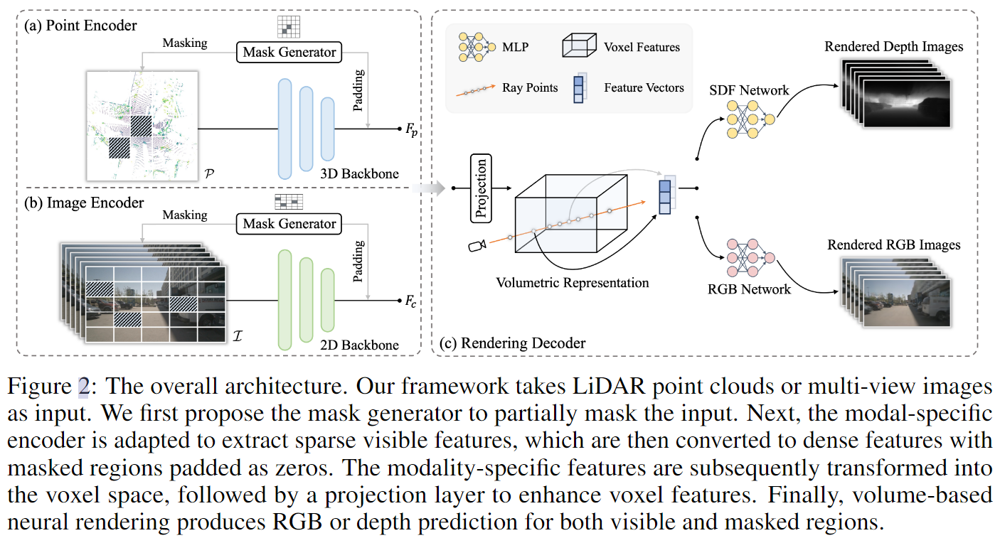</div>
    </details>

    [](https://arxiv.org/abs/2310.08370) [](https://github.com/Nightmare-n/UniPAD)


- **RenderOcc: Vision-Centric 3D Occupancy Prediction with 2D Rendering Supervision**.
    <details span>
    <summary>Abstract</summary>
    3D occupancy prediction holds significant promise in the fields of robot perception and autonomous driving, which quantifies 3D scenes into grid cells with semantic labels. Recent works mainly utilize complete occupancy labels in 3D voxel space for supervision. However, the expensive annotation process and sometimes ambiguous labels have severely constrained the usability and scalability of 3D occupancy models. To address this, we present RenderOcc, a novel paradigm for training 3D occupancy models only using 2D labels. Specifically, we extract a NeRF-style 3D volume representation from multi-view images, and employ volume rendering techniques to establish 2D renderings, thus enabling direct 3D supervision from 2D semantics and depth labels. Additionally, we introduce an Auxiliary Ray method to tackle the issue of sparse viewpoints in autonomous driving scenarios, which leverages sequential frames to construct comprehensive 2D rendering for each object. To our best knowledge, RenderOcc is the first attempt to train multi-view 3D occupancy models only using 2D labels, reducing the dependence on costly 3D occupancy annotations. Extensive experiments demonstrate that RenderOcc achieves comparable performance to models fully supervised with 3D labels, underscoring the significance of this approach in real-world applications.

    <div align=center>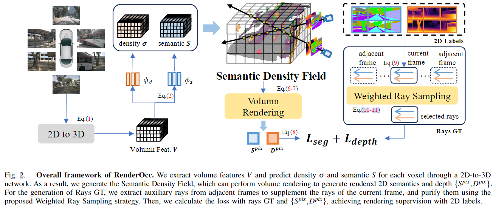</div>
    </details>

    [](https://arxiv.org/abs/2309.09502) [](https://github.com/pmj110119/RenderOcc)

👆 [Back to Top](#Table-of-Content)

### World Model
- **Visual Point Cloud Forecasting enables Scalable Autonomous Driving**.
    <details span>
    <summary>Abstract</summary>
    In contrast to extensive studies on general vision, pre-training for scalable visual autonomous driving remains seldom explored. Visual autonomous driving applications require features encompassing semantics, 3D geometry, and temporal information simultaneously for joint perception, prediction, and planning, posing dramatic challenges for pre-training. To resolve this, we bring up a new pre-training task termed as visual point cloud forecasting - predicting future point clouds from historical visual input. The key merit of this task captures the synergic learning of semantics, 3D structures, and temporal dynamics. Hence it shows superiority in various downstream tasks. To cope with this new problem, we present ViDAR, a general model to pre-train downstream visual encoders. It first extracts historical embeddings by the encoder. These representations are then transformed to 3D geometric space via a novel Latent Rendering operator for future point cloud prediction. Experiments show significant gain in downstream tasks, e.g., 3.1% NDS on 3D detection, ~10% error reduction on motion forecasting, and ~15% less collision rate on planning.

    <div align=center>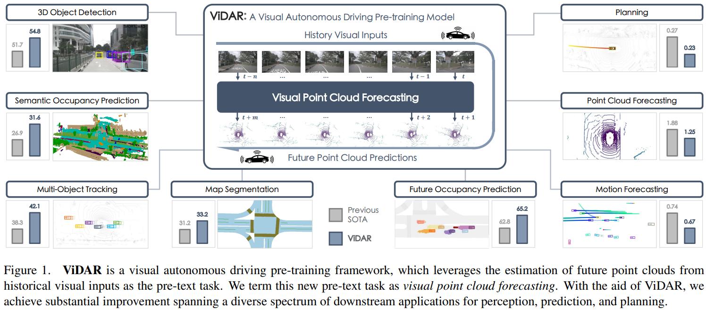</div>
    </details>

    [](https://arxiv.org/abs/2312.17655) [](https://github.com/OpenDriveLab/ViDAR)

- **OccWorld: Learning a 3D Occupancy World Model for Autonomous Driving**.
    <details span>
    <summary>Abstract</summary>
    Understanding how the 3D scene evolves is vital for making decisions in autonomous driving. Most existing methods achieve this by predicting the movements of object boxes, which cannot capture more fine-grained scene information. In this paper, we explore a new framework of learning a world model, OccWorld, in the 3D Occupancy space to simultaneously predict the movement of the ego car and the evolution of the surrounding scenes. We propose to learn a world model based on 3D occupancy rather than 3D bounding boxes and segmentation maps for three reasons: 1) expressiveness. 3D occupancy can describe the more fine-grained 3D structure of the scene; 2) efficiency. 3D occupancy is more economical to obtain (e.g., from sparse LiDAR points). 3) versatility. 3D occupancy can adapt to both vision and LiDAR. To facilitate the modeling of the world evolution, we learn a reconstruction-based scene tokenizer on the 3D occupancy to obtain discrete scene tokens to describe the surrounding scenes. We then adopt a GPT-like spatial-temporal generative transformer to generate subsequent scene and ego tokens to decode the future occupancy and ego trajectory. Extensive experiments on the widely used nuScenes benchmark demonstrate the ability of OccWorld to effectively model the evolution of the driving scenes. OccWorld also produces competitive planning results without using instance and map supervision. 

    <div align=center>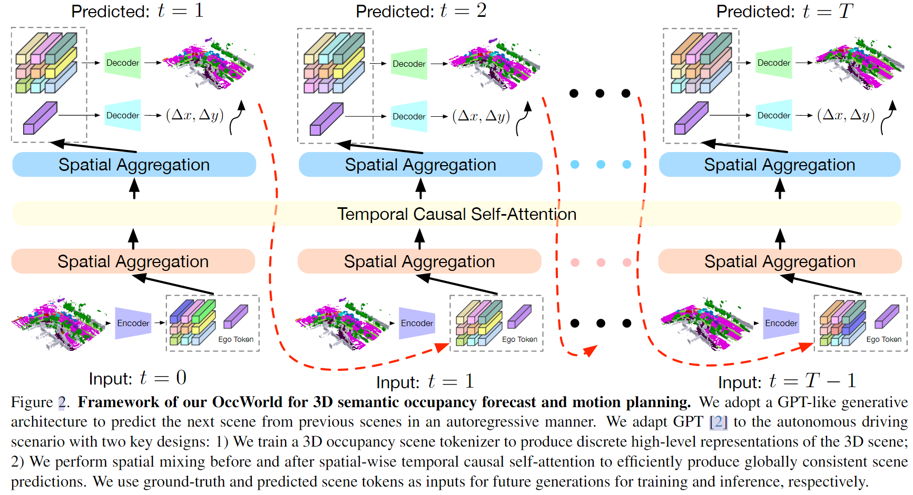</div>
    </details>

    [](https://arxiv.org/abs/2311.16038) [](https://github.com/wzzheng/OccWorld)

- **Driving into the Future: Multiview Visual Forecasting and Planning with World Model for Autonomous Driving**.
    <details span>
    <summary>Abstract</summary>
    In autonomous driving, predicting future events in advance and evaluating the foreseeable risks empowers autonomous vehicles to better plan their actions, enhancing safety and efficiency on the road. To this end, we propose Drive-WM, the first driving world model compatible with existing end-to-end planning models. Through a joint spatial-temporal modeling facilitated by view factorization, our model generates high-fidelity multiview videos in driving scenes. Building on its powerful generation ability, we showcase the potential of applying the world model for safe driving planning for the first time. Particularly, our Drive-WM enables driving into multiple futures based on distinct driving maneuvers, and determines the optimal trajectory according to the image-based rewards. Evaluation on real-world driving datasets verifies that our method could generate high-quality, consistent, and controllable multiview videos, opening up possibilities for real-world simulations and safe planning.

    <div align=center>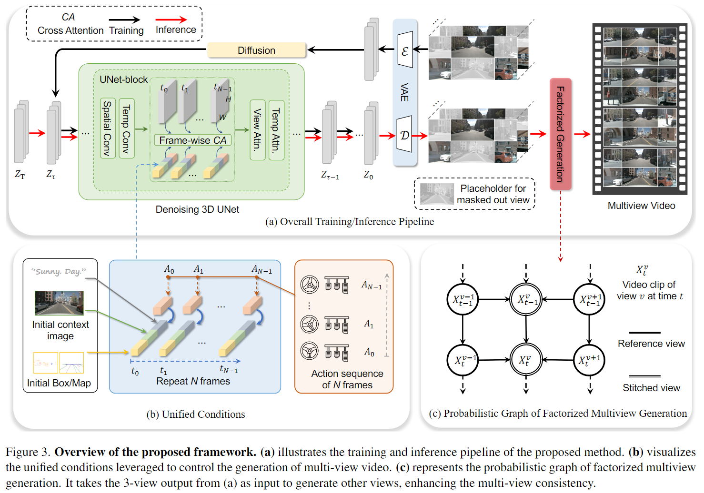</div>
    </details>

    [](https://arxiv.org/abs/2311.17918) [](https://drive-wm.github.io/) [](https://github.com/BraveGroup/Drive-WM)

- **Learning Unsupervised World Models for Autonomous Driving via Discrete Diffusion**.
    <details span>
    <summary>Abstract</summary>
    
    Learning world models can teach an agent how the world works in an unsupervised manner. Even though it can be viewed as a special case of sequence modeling, progress for scaling world models on robotic applications such as autonomous driving has been somewhat less rapid than scaling language models with Generative Pre-trained Transformers (GPT). We identify two reasons as major bottlenecks: dealing with complex and unstructured observation space, and having a scalable generative model. Consequently, we propose a novel world modeling approach that first tokenizes sensor observations with VQVAE, then predicts the future via discrete diffusion. To efficiently decode and denoise tokens in parallel, we recast Masked Generative Image Transformer into the discrete diffusion framework with a few simple changes, resulting in notable improvement. When applied to learning world models on point cloud observations, our model reduces prior SOTA Chamfer distance by more than 65% for 1s prediction, and more than 50% for 3s prediction, across NuScenes, KITTI Odometry, and Argoverse2 datasets. Our results demonstrate that discrete diffusion on tokenized agent experience can unlock the power of GPT-like unsupervised learning for robotic agents.

    <div align=center>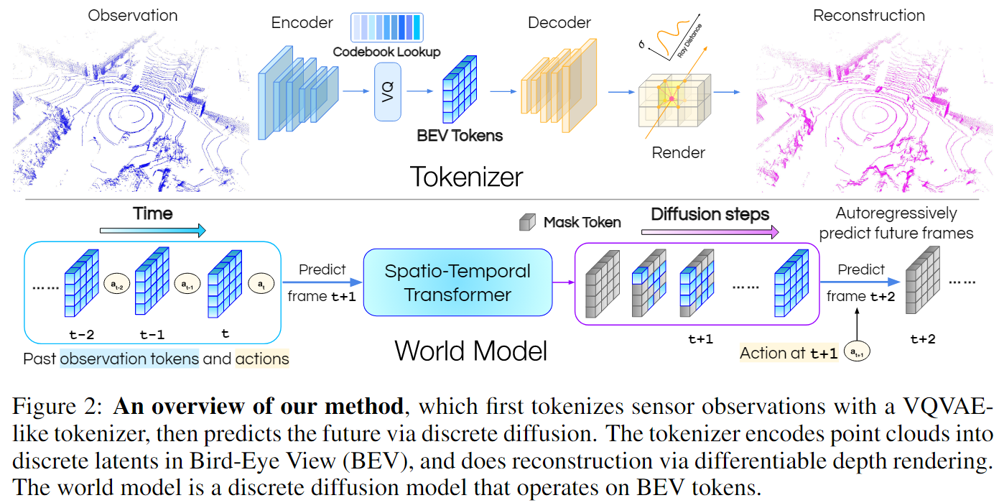</div>
    </details>

    [](https://arxiv.org/abs/2311.01017)

- **ADriver-I: A General World Model for Autonomous Driving**.
    <details span>
    <summary>Abstract</summary>
    Typically, autonomous driving adopts a modular design, which divides the full stack into perception, prediction, planning and control parts. Though interpretable, such modular design tends to introduce a substantial amount of redundancy. Recently, multimodal large language models (MLLM) and diffusion techniques have demonstrated their superior performance on comprehension and generation ability. In this paper, we first introduce the concept of interleaved vision-action pair, which unifies the format of visual features and control signals. Based on the vision-action pairs, we construct a general world model based on MLLM and diffusion model for autonomous driving, termed ADriver-I. It takes the vision-action pairs as inputs and autoregressively predicts the control signal of the current frame. The generated control signals together with the historical vision-action pairs are further conditioned to predict the future frames. With the predicted next frame, ADriver-I performs further control signal prediction. Such a process can be repeated infinite times, ADriver-I achieves autonomous driving in the world created by itself. Extensive experiments are conducted on nuScenes and our large-scale private datasets. ADriver-I shows impressive performance compared to several constructed baselines. We hope our ADriver-I can provide some new insights for future autonomous driving and embodied intelligence.

    <div align=center>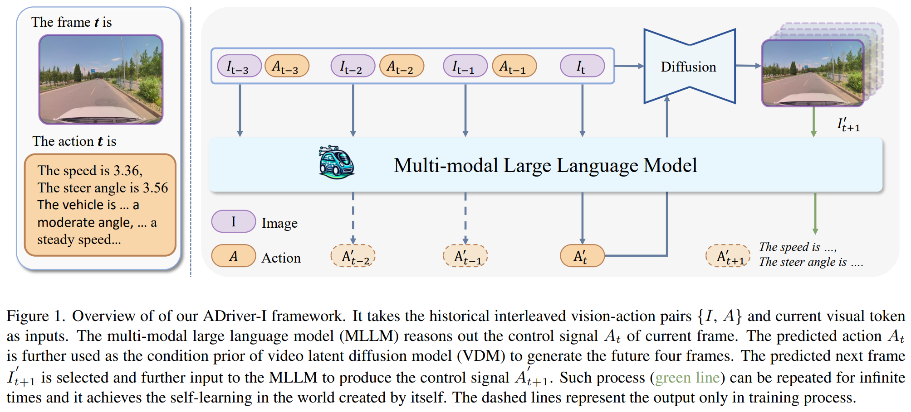</div>
    </details>

    [](https://arxiv.org/abs/2311.13549)

- **MUVO: A Multimodal Generative World Model for Autonomous Driving with Geometric Representations**.
    <details span>
    <summary>Abstract</summary>
    Learning unsupervised world models for autonomous driving has the potential to improve the reasoning capabilities of today's systems dramatically. However, most work neglects the physical attributes of the world and focuses on sensor data alone. We propose MUVO, a MUltimodal World Model with Geometric VOxel Representations to address this challenge. We utilize raw camera and lidar data to learn a sensor-agnostic geometric representation of the world, which can directly be used by downstream tasks, such as planning. We demonstrate multimodal future predictions and show that our geometric representation improves the prediction quality of both camera images and lidar point clouds.

    <div align=center>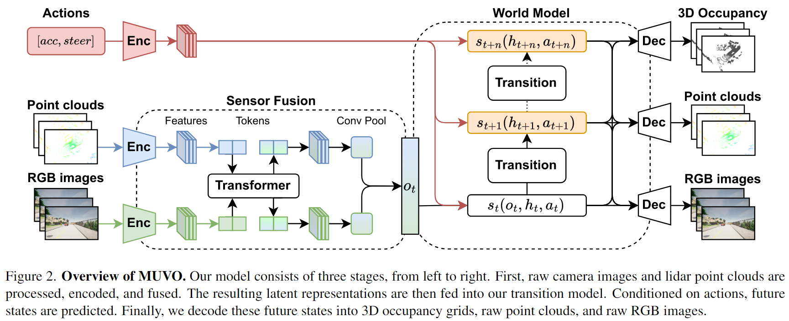</div>
    </details>

    [](https://arxiv.org/abs/2311.11762)

- **GAIA-1: A Generative World Model for Autonomous Driving**.
    <details span>
    <summary>Abstract</summary>
    Autonomous driving promises transformative improvements to transportation, but building systems capable of safely navigating the unstructured complexity of real-world scenarios remains challenging. A critical problem lies in effectively predicting the various potential outcomes that may emerge in response to the vehicle's actions as the world evolves. To address this challenge, we introduce GAIA-1 ('Generative AI for Autonomy'), a generative world model that leverages video, text, and action inputs to generate realistic driving scenarios while offering fine-grained control over ego-vehicle behavior and scene features. Our approach casts world modeling as an unsupervised sequence modeling problem by mapping the inputs to discrete tokens, and predicting the next token in the sequence. Emerging properties from our model include learning high-level structures and scene dynamics, contextual awareness, generalization, and understanding of geometry. The power of GAIA-1's learned representation that captures expectations of future events, combined with its ability to generate realistic samples, provides new possibilities for innovation in the field of autonomy, enabling enhanced and accelerated training of autonomous driving technology.

    <div align=center>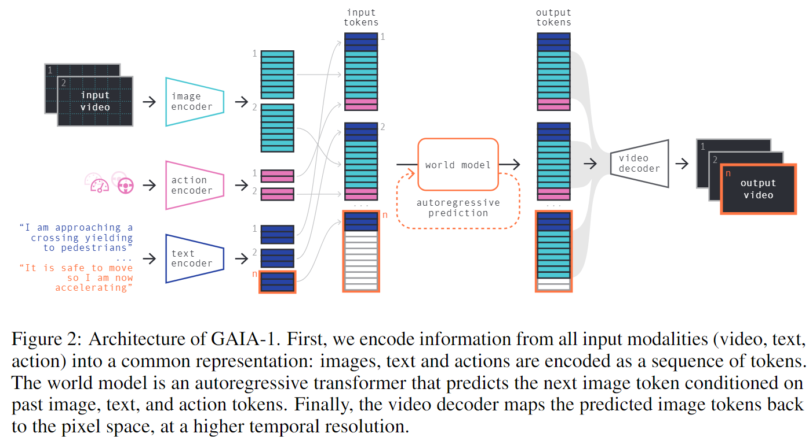</div>
    </details>

    [](https://arxiv.org/abs/2309.17080)

- **TrafficBots: Towards World Models for Autonomous Driving Simulation and Motion Prediction**.
    <details span>
    <summary>Abstract</summary>
    Data-driven simulation has become a favorable way to train and test autonomous driving algorithms. The idea of replacing the actual environment with a learned simulator has also been explored in model-based reinforcement learning in the context of world models. In this work, we show data-driven traffic simulation can be formulated as a world model. We present TrafficBots, a multi-agent policy built upon motion prediction and end-to-end driving, and based on TrafficBots we obtain a world model tailored for the planning module of autonomous vehicles. Existing data-driven traffic simulators are lacking configurability and scalability. To generate configurable behaviors, for each agent we introduce a destination as navigational information, and a time-invariant latent personality that specifies the behavioral style. To improve the scalability, we present a new scheme of positional encoding for angles, allowing all agents to share the same vectorized context and the use of an architecture based on dot-product attention. As a result, we can simulate all traffic participants seen in dense urban scenarios. Experiments on the Waymo open motion dataset show TrafficBots can simulate realistic multi-agent behaviors and achieve good performance on the motion prediction task.

    <div align=center>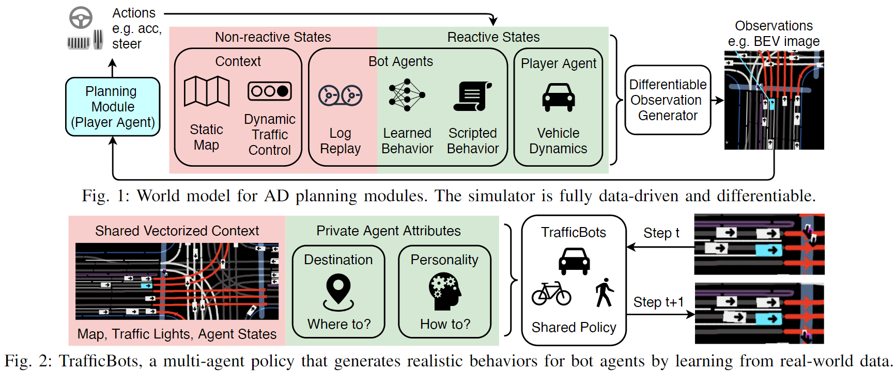</div>
    </details>

    [](https://arxiv.org/abs/2303.04116) [](https://zhejz.github.io/trafficbots) [](https://github.com/zhejz/TrafficBots)

👆 [Back to Top](#Table-of-Content)

## Adaptation
### Vision Foundation Models

- **RadOcc: Learning Cross-Modality Occupancy Knowledge through Rendering Assisted Distillation**.
    <details span>
    <summary>Abstract</summary>
    3D occupancy prediction is an emerging task that aims to estimate the occupancy states and semantics of 3D scenes using multi-view images. However, image-based scene perception encounters significant challenges in achieving accurate prediction due to the absence of geometric priors. In this paper, we address this issue by exploring cross-modal knowledge distillation in this task, i.e., we leverage a stronger multi-modal model to guide the visual model during training. In practice, we observe that directly applying features or logits alignment, proposed and widely used in bird's-eyeview (BEV) perception, does not yield satisfactory results. To overcome this problem, we introduce RadOcc, a Rendering assisted distillation paradigm for 3D Occupancy prediction. By employing differentiable volume rendering, we generate depth and semantic maps in perspective views and propose two novel consistency criteria between the rendered outputs of teacher and student models. Specifically, the depth consistency loss aligns the termination distributions of the rendered rays, while the semantic consistency loss mimics the intra-segment similarity guided by vision foundation models (VLMs). Experimental results on the nuScenes dataset demonstrate the effectiveness of our proposed method in improving various 3D occupancy prediction approaches, e.g., our proposed methodology enhances our baseline by 2.2% in the metric of mIoU and achieves 50% in Occ3D benchmark.

    <div align=center>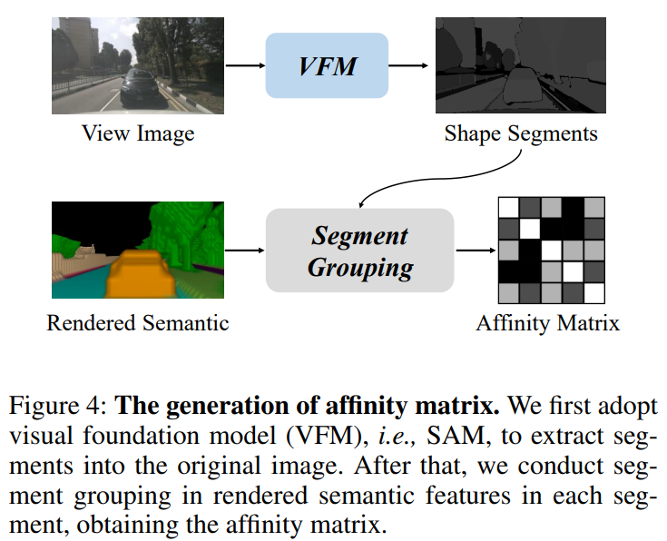</div>
    </details>

    [](https://arxiv.org/abs/2312.11829)

- **Learning to Adapt SAM for Segmenting Cross-domain Point Clouds**.
    <details span>
    <summary>Abstract</summary>
    Unsupervised domain adaptation (UDA) in 3D segmentation tasks presents a formidable challenge, primarily stemming from the sparse and unordered nature of point cloud data. Especially for LiDAR point clouds, the domain discrepancy becomes obvious across varying capture scenes, fluctuating weather conditions, and the diverse array of LiDAR devices in use. While previous UDA methodologies have often sought to mitigate this gap by aligning features between source and target domains, this approach falls short when applied to 3D segmentation due to the substantial domain variations. Inspired by the remarkable generalization capabilities exhibited by the vision foundation model, SAM, in the realm of image segmentation, our approach leverages the wealth of general knowledge embedded within SAM to unify feature representations across diverse 3D domains and further solves the 3D domain adaptation problem. Specifically, we harness the corresponding images associated with point clouds to facilitate knowledge transfer and propose an innovative hybrid feature augmentation methodology, which significantly enhances the alignment between the 3D feature space and SAM's feature space, operating at both the scene and instance levels. Our method is evaluated on many widely-recognized datasets and achieves state-of-the-art performance.

    <div align=center>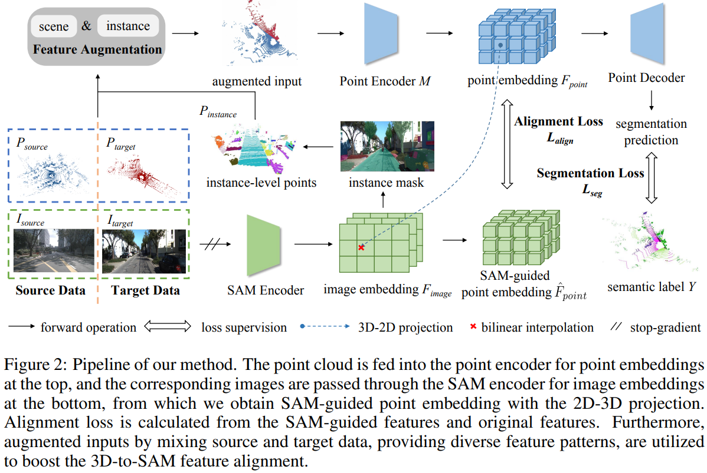</div>
    </details>

    [](https://arxiv.org/abs/2310.08820)


- **Few-Shot Panoptic Segmentation With Foundation Models**.
    <details span>
    <summary>Abstract</summary>
    Current state-of-the-art methods for panoptic segmentation require an immense amount of annotated training data that is both arduous and expensive to obtain posing a significant challenge for their widespread adoption. Concurrently, recent breakthroughs in visual representation learning have sparked a paradigm shift leading to the advent of large foundation models that can be trained with completely unlabeled images. In this work, we propose to leverage such task-agnostic image features to enable few-shot panoptic segmentation by presenting Segmenting Panoptic Information with Nearly 0 labels (SPINO). In detail, our method combines a DINOv2 backbone with lightweight network heads for semantic segmentation and boundary estimation. We show that our approach, albeit being trained with only ten annotated images, predicts high-quality pseudo-labels that can be used with any existing panoptic segmentation method. Notably, we demonstrate that SPINO achieves competitive results compared to fully supervised baselines while using less than 0.3% of the ground truth labels, paving the way for learning complex visual recognition tasks leveraging foundation models. To illustrate its general applicability, we further deploy SPINO on real-world robotic vision systems for both outdoor and indoor environments.

    <div align=center>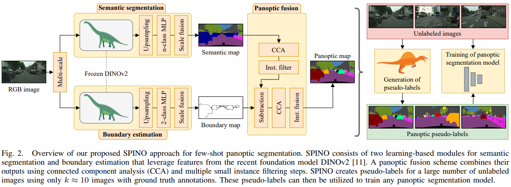</div>
    </details>

    [](https://arxiv.org/abs/2309.10726) [](http://spino.cs.uni-freiburg.de/) [](https://github.com/robot-learning-freiburg/SPINO)

- **Segment Any Point Cloud Sequences by Distilling Vision Foundation Models**.
    <details span>
    <summary>Abstract</summary>
    Recent advancements in vision foundation models (VFMs) have opened up new possibilities for versatile and efficient visual perception. In this work, we introduceSeal, a novel framework that harnesses VFMs for segmenting diverse automotive point cloud sequences. Seal exhibits three appealing properties: i) Scalability:VFMs are directly distilled into point clouds, eliminating the need for annotations in either 2D or 3D during pretraining. ii) Consistency: Spatial and temporal relationships are enforced at both the camera-to-LiDAR and point-to-segment stages, facilitating cross-modal representation learning. iii) Generalizability: Seal enables knowledge transfer in an off-the-shelf manner to downstream tasks involving diverse point clouds, including those from real/synthetic, low/high-resolution, large/small-scale, and clean/corrupted datasets. Extensive experiments conducted on eleven different point cloud datasets showcase the effectiveness and superiority of Seal. Notably, Seal achieves a remarkable 45.0% mIoU on nuScenes after linear probing, surpassing random initialization by 36.9% mIoU and outperforming prior arts by 6.1% mIoU. Moreover, Seal demonstrates significant performance gains over existing methods across 20 different few-shot fine-tuning tasks on all eleven tested point cloud datasets.

    <div align=center></div>
    </details>

    [](https://arxiv.org/abs/2306.09347) [](https://ldkong.com/Seal) [](https://github.com/youquanl/Segment-Any-Point-Cloud)


- **Calib-Anything: Zero-training LiDAR-Camera Extrinsic Calibration Method Using Segment Anything**.
    <details span>
    <summary>Abstract</summary>
    The research on extrinsic calibration between Light Detection and Ranging(LiDAR) and camera are being promoted to a more accurate, automatic and generic manner. Since deep learning has been employed in calibration, the restrictions on the scene are greatly reduced. However, data driven method has the drawback of low transfer-ability. It cannot adapt to dataset variations unless additional training is taken. With the advent of foundation model, this problem can be significantly mitigated. By using the Segment Anything Model(SAM), we propose a novel LiDAR-camera calibration method, which requires zero extra training and adapts to common scenes. With an initial guess, we opimize the extrinsic parameter by maximizing the consistency of points that are projected inside each image mask. The consistency includes three properties of the point cloud: the intensity, normal vector and categories derived from some segmentation methods. The experiments on different dataset have demonstrated the generality and comparable accuracy of our method. 

    <div align=center>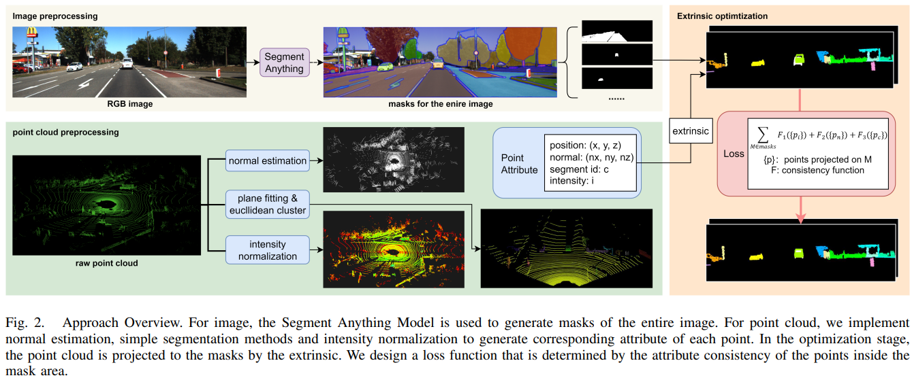</div>
    </details>

    [](https://arxiv.org/abs/2306.02656) [](https://github.com/OpenCalib/CalibAnything)

- **Robustness of Segment Anything Model (SAM) for Autonomous Driving in Adverse Weather Conditions**.
    <details span>
    <summary>Abstract</summary>
    Segment Anything Model (SAM) has gained considerable interest in recent times for its remarkable performance and has emerged as a foundational model in computer vision. It has been integrated in diverse downstream tasks, showcasing its strong zero-shot transfer capabilities. Given its impressive performance, there is a strong desire to apply SAM in autonomous driving to improve the performance of vision tasks, particularly in challenging scenarios such as driving under adverse weather conditions. However, its robustness under adverse weather conditions remains uncertain. In this work, we investigate the application of SAM in autonomous driving and specifically explore its robustness under adverse weather conditions. Overall, this work aims to enhance understanding of SAM's robustness in challenging scenarios before integrating it into autonomous driving vision tasks, providing valuable insights for future applications.

    <div align=center>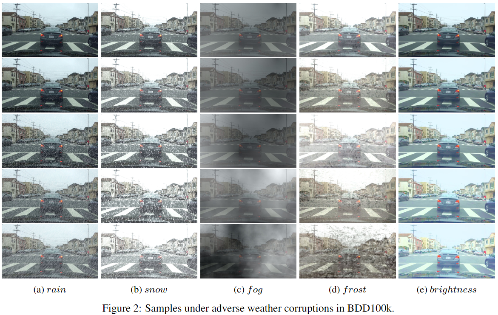</div>
    </details>

    [](https://arxiv.org/abs/2306.13290)

👆 [Back to Top](#Table-of-Content)

### Large Language Models
- **GPT-Driver: Learning to Drive with GPT**.
    <details span>
    <summary>Abstract</summary>
    We present a simple yet effective approach that can transform the OpenAI GPT-3.5 model into a reliable motion planner for autonomous vehicles. Motion planning is a core challenge in autonomous driving, aiming to plan a driving trajectory that is safe and comfortable. Existing motion planners predominantly leverage heuristic methods to forecast driving trajectories, yet these approaches demonstrate insufficient generalization capabilities in the face of novel and unseen driving scenarios. In this paper, we propose a novel approach to motion planning that capitalizes on the strong reasoning capabilities and generalization potential inherent to Large Language Models (LLMs). The fundamental insight of our approach is the reformulation of motion planning as a language modeling problem, a perspective not previously explored. Specifically, we represent the planner inputs and outputs as language tokens, and leverage the LLM to generate driving trajectories through a language description of coordinate positions. Furthermore, we propose a novel prompting-reasoning-finetuning strategy to stimulate the numerical reasoning potential of the LLM. With this strategy, the LLM can describe highly precise trajectory coordinates and also its internal decision-making process in natural language. We evaluate our approach on the large-scale nuScenes dataset, and extensive experiments substantiate the effectiveness, generalization ability, and interpretability of our GPT-based motion planner.

    <div align=center>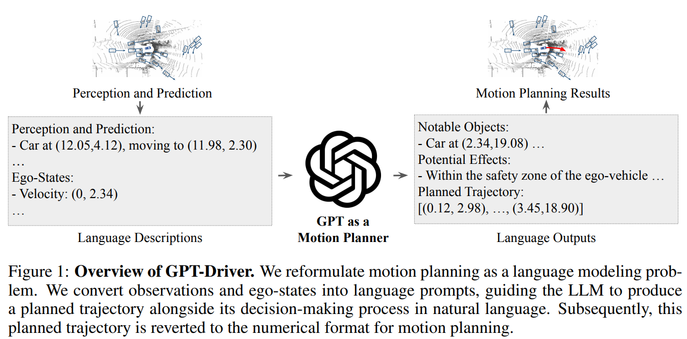</div>
    </details>

    [](https://arxiv.org/abs/2310.01415) [](https://pointscoder.github.io/projects/gpt_driver/index.html) [](https://github.com/PointsCoder/GPT-Driver)

- **LanguageMPC: Large Language Models as Decision Makers for Autonomous Driving**.
    <details span>
    <summary>Abstract</summary>
    Existing learning-based autonomous driving (AD) systems face challenges in comprehending high-level information, generalizing to rare events, and providing interpretability. To address these problems, this work employs Large Language Models (LLMs) as a decision-making component for complex AD scenarios that require human commonsense understanding. We devise cognitive pathways to enable comprehensive reasoning with LLMs, and develop algorithms for translating LLM decisions into actionable driving commands. Through this approach, LLM decisions are seamlessly integrated with low-level controllers by guided parameter matrix adaptation. Extensive experiments demonstrate that our proposed method not only consistently surpasses baseline approaches in single-vehicle tasks, but also helps handle complex driving behaviors even multi-vehicle coordination, thanks to the commonsense reasoning capabilities of LLMs. This paper presents an initial step toward leveraging LLMs as effective decision-makers for intricate AD scenarios in terms of safety, efficiency, generalizability, and interoperability. We aspire for it to serve as inspiration for future research in this field.

    <div align=center>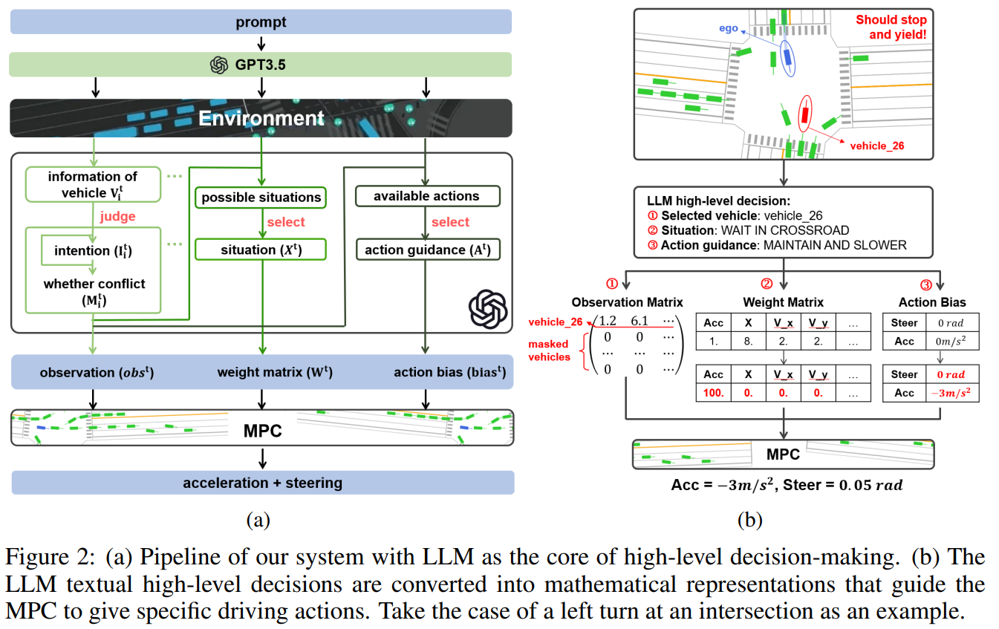</div>
    </details>

    [](https://arxiv.org/abs/2310.03026) [](https://sites.google.com/view/llm-mpc)

- **HiLM-D: Towards High-Resolution Understanding in Multimodal Large Language Models for Autonomous Driving**.
    <details span>
    <summary>Abstract</summary>
    Autonomous driving systems generally employ separate models for different tasks resulting in intricate designs. For the first time, we leverage singular multimodal large language models (MLLMs) to consolidate multiple autonomous driving tasks from videos, i.e., the Risk Object Localization and Intention and Suggestion Prediction (ROLISP) task. ROLISP uses natural language to simultaneously identify and interpret risk objects, understand ego-vehicle intentions, and provide motion suggestions, eliminating the necessity for task-specific architectures. However, lacking high-resolution (HR) information, existing MLLMs often miss small objects (e.g., traffic cones) and overly focus on salient ones (e.g., large trucks) when applied to ROLISP. We propose HiLM-D (Towards High-Resolution Understanding in MLLMs for Autonomous Driving), an efficient method to incorporate HR information into MLLMs for the ROLISP task. Especially, HiLM-D integrates two branches: (i) the low-resolution reasoning branch, can be any MLLMs, processes low-resolution videos to caption risk objects and discern ego-vehicle intentions/suggestions; (ii) the high-resolution perception branch (HR-PB), prominent to HiLM-D,, ingests HR images to enhance detection by capturing vision-specific HR feature maps and prioritizing all potential risks over merely salient objects. Our HR-PB serves as a plug-and-play module, seamlessly fitting into current MLLMs. Experiments on the ROLISP benchmark reveal HiLM-D's notable advantage over leading MLLMs, with improvements of 4.8% in BLEU-4 for captioning and 17.2% in mIoU for detection.

    <div align=center>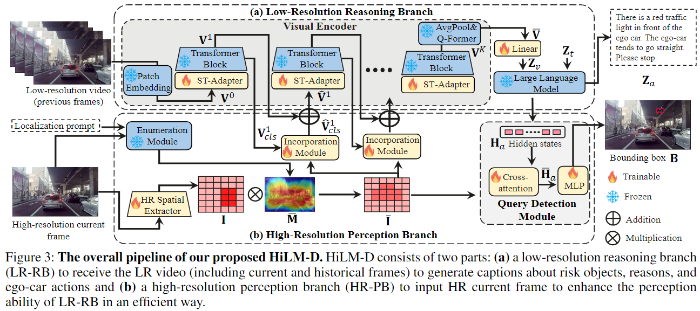</div>
    </details>

    [](https://arxiv.org/abs/2309.05186)

- **Language Prompt for Autonomous Driving**.
    <details span>
    <summary>Abstract</summary>
    A new trend in the computer vision community is to capture objects of interest following flexible human command represented by a natural language prompt. However, the progress of using language prompts in driving scenarios is stuck in a bottleneck due to the scarcity of paired prompt-instance data. To address this challenge, we propose the first object-centric language prompt set for driving scenes within 3D, multi-view, and multi-frame space, named NuPrompt. It expands Nuscenes dataset by constructing a total of 35,367 language descriptions, each referring to an average of 5.3 object tracks. Based on the object-text pairs from the new benchmark, we formulate a new prompt-based driving task, \ie, employing a language prompt to predict the described object trajectory across views and frames. Furthermore, we provide a simple end-to-end baseline model based on Transformer, named PromptTrack. Experiments show that our PromptTrack achieves impressive performance on NuPrompt. We hope this work can provide more new insights for the autonomous driving community.

    <div align=center></div>
    </details>

    [](https://arxiv.org/abs/2309.04379) [](https://github.com/wudongming97/Prompt4Driving)

- **Drive Like a Human: Rethinking Autonomous Driving with Large Language Models**.
    <details span>
    <summary>Abstract</summary>
    In this paper, we explore the potential of using a large language model (LLM) to understand the driving environment in a human-like manner and analyze its ability to reason, interpret, and memorize when facing complex scenarios. We argue that traditional optimization-based and modular autonomous driving (AD) systems face inherent performance limitations when dealing with long-tail corner cases. To address this problem, we propose that an ideal AD system should drive like a human, accumulating experience through continuous driving and using common sense to solve problems. To achieve this goal, we identify three key abilities necessary for an AD system: reasoning, interpretation, and memorization. We demonstrate the feasibility of employing an LLM in driving scenarios by building a closed-loop system to showcase its comprehension and environment-interaction abilities. Our extensive experiments show that the LLM exhibits the impressive ability to reason and solve long-tailed cases, providing valuable insights for the development of human-like autonomous driving. 

    <div align=center>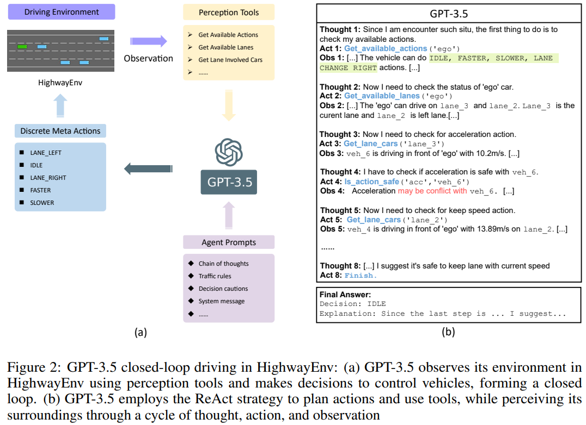</div>
    </details>

    [](https://arxiv.org/abs/2307.07162) [](https://github.com/PJLab-ADG/DriveLikeAHuman)


👆 [Back to Top](#Table-of-Content)

### Multimodal Foundation Models

- **DriveLM: Driving with Graph Visual Question Answering**.
    <details span>
    <summary>Abstract</summary>
    We study how vision-language models (VLMs) trained on web-scale data can be integrated into end-to-end driving systems to boost generalization and enable interactivity with human users. While recent approaches adapt VLMs to driving via single-round visual question answering (VQA), human drivers reason about decisions in multiple steps. Starting from the localization of key objects, humans estimate object interactions before taking actions. The key insight is that with our proposed task, Graph VQA, where we model graph-structured reasoning through perception, prediction and planning question-answer pairs, we obtain a suitable proxy task to mimic the human reasoning process. We instantiate datasets (DriveLM-Data) built upon nuScenes and CARLA, and propose a VLM-based baseline approach (DriveLM-Agent) for jointly performing Graph VQA and end-to-end driving. The experiments demonstrate that Graph VQA provides a simple, principled framework for reasoning about a driving scene, and DriveLM-Data provides a challenging benchmark for this task. Our DriveLM-Agent baseline performs end-to-end autonomous driving competitively in comparison to state-of-the-art driving-specific architectures. Notably, its benefits are pronounced when it is evaluated zero-shot on unseen objects or sensor configurations. We hope this work can be the starting point to shed new light on how to apply VLMs for autonomous driving.

    <div align=center>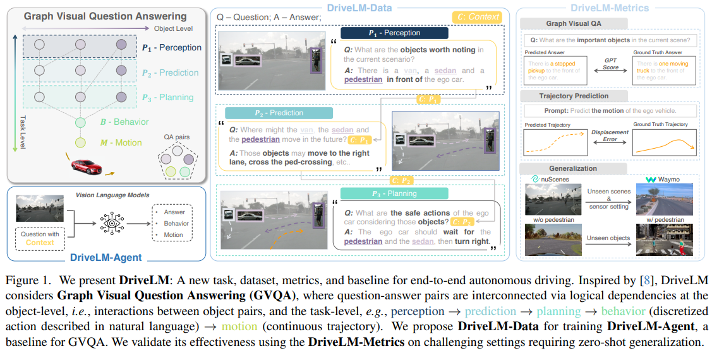</div>
    </details>

    [](https://arxiv.org/abs/2312.14150) [](https://github.com/OpenDriveLab/DriveLM)


- **Dolphins: Multimodal Language Model for Driving**.
    <details span>
    <summary>Abstract</summary>
    The quest for fully autonomous vehicles (AVs) capable of navigating complex real-world scenarios with human-like understanding and responsiveness. In this paper, we introduce Dolphins, a novel vision-language model architected to imbibe human-like abilities as a conversational driving assistant. Dolphins is adept at processing multimodal inputs comprising video (or image) data, text instructions, and historical control signals to generate informed outputs corresponding to the provided instructions. Building upon the open-sourced pretrained Vision-Language Model, OpenFlamingo, we first enhance Dolphins's reasoning capabilities through an innovative Grounded Chain of Thought (GCoT) process. Then we tailored Dolphins to the driving domain by constructing driving-specific instruction data and conducting instruction tuning. Through the utilization of the BDD-X dataset, we designed and consolidated four distinct AV tasks into Dolphins to foster a holistic understanding of intricate driving scenarios. As a result, the distinctive features of Dolphins are characterized into two dimensions: (1) the ability to provide a comprehensive understanding of complex and long-tailed open-world driving scenarios and solve a spectrum of AV tasks, and (2) the emergence of human-like capabilities including gradient-free instant adaptation via in-context learning and error recovery via reflection.

    <div align=center>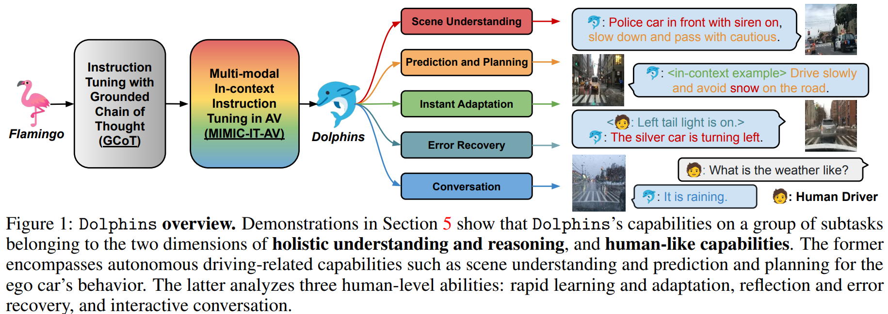</div>
    </details>

    [](https://arxiv.org/abs/2312.00438) [](https://vlm-driver.github.io/) [](https://github.com/vlm-driver/Dolphins)

- **On the Road with GPT-4V(ision): Early Explorations of Visual-Language Model on Autonomous Driving**.
    <details span>
    <summary>Abstract</summary>
    The pursuit of autonomous driving technology hinges on the sophisticated integration of perception, decision-making, and control systems. Traditional approaches, both data-driven and rule-based, have been hindered by their inability to grasp the nuance of complex driving environments and the intentions of other road users. This has been a significant bottleneck, particularly in the development of common sense reasoning and nuanced scene understanding necessary for safe and reliable autonomous driving. The advent of Visual Language Models (VLM) represents a novel frontier in realizing fully autonomous vehicle driving. This report provides an exhaustive evaluation of the latest state-of-the-art VLM, GPT-4V(ision), and its application in autonomous driving scenarios. We explore the model's abilities to understand and reason about driving scenes, make decisions, and ultimately act in the capacity of a driver. Our comprehensive tests span from basic scene recognition to complex causal reasoning and real-time decision-making under varying conditions. Our findings reveal that GPT-4V demonstrates superior performance in scene understanding and causal reasoning compared to existing autonomous systems. It showcases the potential to handle out-of-distribution scenarios, recognize intentions, and make informed decisions in real driving contexts. However, challenges remain, particularly in direction discernment, traffic light recognition, vision grounding, and spatial reasoning tasks. These limitations underscore the need for further research and development.

    <div align=center>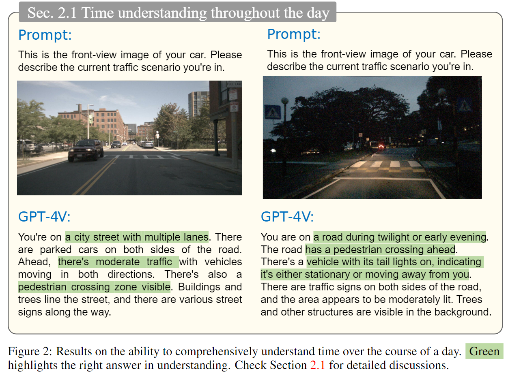</div>
    </details>

    [](https://arxiv.org/abs/2311.05332) [](https://github.com/PJLab-ADG/GPT4V-AD-Exploration)

- **Convolutions Die Hard: Open-Vocabulary Segmentation with Single Frozen Convolutional CLIP**.
    <details span>
    <summary>Abstract</summary>
    Open-vocabulary segmentation is a challenging task requiring segmenting and recognizing objects from an open set of categories. One way to address this challenge is to leverage multi-modal models, such as CLIP, to provide image and text features in a shared embedding space, which bridges the gap between closed-vocabulary and open-vocabulary recognition. Hence, existing methods often adopt a two-stage framework to tackle the problem, where the inputs first go through a mask generator and then through the CLIP model along with the predicted masks. This process involves extracting features from images multiple times, which can be ineffective and inefficient. By contrast, we propose to build everything into a single-stage framework using a shared Frozen Convolutional CLIP backbone, which not only significantly simplifies the current two-stage pipeline, but also remarkably yields a better accuracy-cost trade-off. The proposed FC-CLIP, benefits from the following observations: the frozen CLIP backbone maintains the ability of open-vocabulary classification and can also serve as a strong mask generator, and the convolutional CLIP generalizes well to a larger input resolution than the one used during contrastive image-text pretraining. When training on COCO panoptic data only and testing in a zero-shot manner, FC-CLIP achieve 26.8 PQ, 16.8 AP, and 34.1 mIoU on ADE20K, 18.2 PQ, 27.9 mIoU on Mapillary Vistas, 44.0 PQ, 26.8 AP, 56.2 mIoU on Cityscapes, outperforming the prior art by +4.2 PQ, +2.4 AP, +4.2 mIoU on ADE20K, +4.0 PQ on Mapillary Vistas and +20.1 PQ on Cityscapes, respectively. Additionally, the training and testing time of FC-CLIP is 7.5x and 6.6x significantly faster than the same prior art, while using 5.9x fewer parameters. FC-CLIP also sets a new state-of-the-art performance across various open-vocabulary semantic segmentation datasets.

    <div align=center>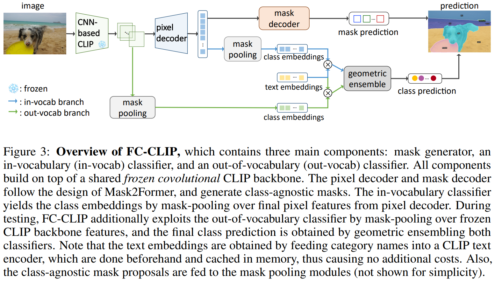</div>
    </details>

    [](https://arxiv.org/abs/2308.02487) [](https://github.com/bytedance/fc-clip)

- **OVO: Open-Vocabulary Occupancy**.
    <details span>
    <summary>Abstract</summary>
    Semantic occupancy prediction aims to infer dense geometry and semantics of surroundings for an autonomous agent to operate safely in the 3D environment. Existing occupancy prediction methods are almost entirely trained on human-annotated volumetric data. Although of high quality, the generation of such 3D annotations is laborious and costly, restricting them to a few specific object categories in the training dataset. To address this limitation, this paper proposes Open Vocabulary Occupancy (OVO), a novel approach that allows semantic occupancy prediction of arbitrary classes but without the need for 3D annotations during training. Keys to our approach are (1) knowledge distillation from a pre-trained 2D open-vocabulary segmentation model to the 3D occupancy network, and (2) pixel-voxel filtering for high-quality training data generation. The resulting framework is simple, compact, and compatible with most state-of-the-art semantic occupancy prediction models. On NYUv2 and SemanticKITTI datasets, OVO achieves competitive performance compared to supervised semantic occupancy prediction approaches. Furthermore, we conduct extensive analyses and ablation studies to offer insights into the design of the proposed framework.

    <div align=center>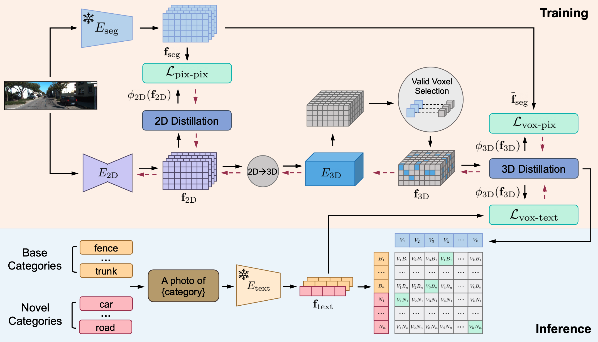</div>
    </details>

    [](https://arxiv.org/abs/2305.16133) [](https://github.com/dzcgaara/OVO-Open-Vocabulary-Occupancy)

- **Open-Vocabulary Panoptic Segmentation with Text-to-Image Diffusion Models**.
    <details span>
    <summary>Abstract</summary>
    We present ODISE: Open-vocabulary DIffusion-based panoptic SEgmentation, which unifies pre-trained text-image diffusion and discriminative models to perform open-vocabulary panoptic segmentation. Text-to-image diffusion models have the remarkable ability to generate high-quality images with diverse open-vocabulary language descriptions. This demonstrates that their internal representation space is highly correlated with open concepts in the real world. Text-image discriminative models like CLIP, on the other hand, are good at classifying images into open-vocabulary labels. We leverage the frozen internal representations of both these models to perform panoptic segmentation of any category in the wild. Our approach outperforms the previous state of the art by significant margins on both open-vocabulary panoptic and semantic segmentation tasks. In particular, with COCO training only, our method achieves 23.4 PQ and 30.0 mIoU on the ADE20K dataset, with 8.3 PQ and 7.9 mIoU absolute improvement over the previous state of the art.

    <div align=center></div>
    </details>

    [](https://arxiv.org/abs/2303.04803) [](https://jerryxu.net/ODISE/) [](https://github.com/NVlabs/ODISE)

- **CLIP2Scene: Towards Label-efficient 3D Scene Understanding by CLIP**.
    <details span>
    <summary>Abstract</summary>
    Contrastive Language-Image Pre-training (CLIP) achieves promising results in 2D zero-shot and few-shot learning. Despite the impressive performance in 2D, applying CLIP to help the learning in 3D scene understanding has yet to be explored. In this paper, we make the first attempt to investigate how CLIP knowledge benefits 3D scene understanding. We propose CLIP2Scene, a simple yet effective framework that transfers CLIP knowledge from 2D image-text pre-trained models to a 3D point cloud network. We show that the pre-trained 3D network yields impressive performance on various downstream tasks, i.e., annotation-free and fine-tuning with labelled data for semantic segmentation. Specifically, built upon CLIP, we design a Semantic-driven Cross-modal Contrastive Learning framework that pre-trains a 3D network via semantic and spatial-temporal consistency regularization. For the former, we first leverage CLIP's text semantics to select the positive and negative point samples and then employ the contrastive loss to train the 3D network. In terms of the latter, we force the consistency between the temporally coherent point cloud features and their corresponding image features. We conduct experiments on SemanticKITTI, nuScenes, and ScanNet. For the first time, our pre-trained network achieves annotation-free 3D semantic segmentation with 20.8% and 25.08% mIoU on nuScenes and ScanNet, respectively. When fine-tuned with 1% or 100% labelled data, our method significantly outperforms other self-supervised methods, with improvements of 8% and 1% mIoU, respectively. Furthermore, we demonstrate the generalizability for handling cross-domain datasets.

    <div align=center>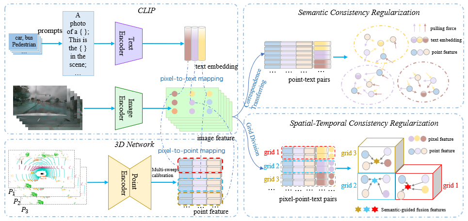</div>
    </details>

    [](https://arxiv.org/abs/2301.04926) [](https://github.com/runnanchen/CLIP2Scene)

- **MaskCLIP: Masked Self-Distillation Advances Contrastive Language-Image Pretraining**.
    <details span>
    <summary>Abstract</summary>
    This paper presents a simple yet effective framework MaskCLIP, which incorporates a newly proposed masked self-distillation into contrastive language-image pretraining. The core idea of masked self-distillation is to distill representation from a full image to the representation predicted from a masked image. Such incorporation enjoys two vital benefits. First, masked self-distillation targets local patch representation learning, which is complementary to vision-language contrastive focusing on text-related representation. Second, masked self-distillation is also consistent with vision-language contrastive from the perspective of training objective as both utilize the visual encoder for feature aligning, and thus is able to learn local semantics getting indirect supervision from the language. We provide specially designed experiments with a comprehensive analysis to validate the two benefits. Symmetrically, we also introduce the local semantic supervision into the text branch, which further improves the pretraining performance. With extensive experiments, we show that MaskCLIP, when applied to various challenging downstream tasks, achieves superior results in linear probing, finetuning, and zero-shot performance with the guidance of the language encoder. 
    </details>

    [](https://arxiv.org/abs/2208.12262) [](https://www.mmlab-ntu.com/project/maskclip/) [](https://github.com/chongzhou96/MaskCLIP)

- **Language-driven Semantic Segmentation**.
    <details span>
    <summary>Abstract</summary>
    We present LSeg, a novel model for language-driven semantic image segmentation. LSeg uses a text encoder to compute embeddings of descriptive input labels (e.g., "grass" or "building") together with a transformer-based image encoder that computes dense per-pixel embeddings of the input image. The image encoder is trained with a contrastive objective to align pixel embeddings to the text embedding of the corresponding semantic class. The text embeddings provide a flexible label representation in which semantically similar labels map to similar regions in the embedding space (e.g., "cat" and "furry"). This allows LSeg to generalize to previously unseen categories at test time, without retraining or even requiring a single additional training sample. We demonstrate that our approach achieves highly competitive zero-shot performance compared to existing zero- and few-shot semantic segmentation methods, and even matches the accuracy of traditional segmentation algorithms when a fixed label set is provided.

    <div align=center>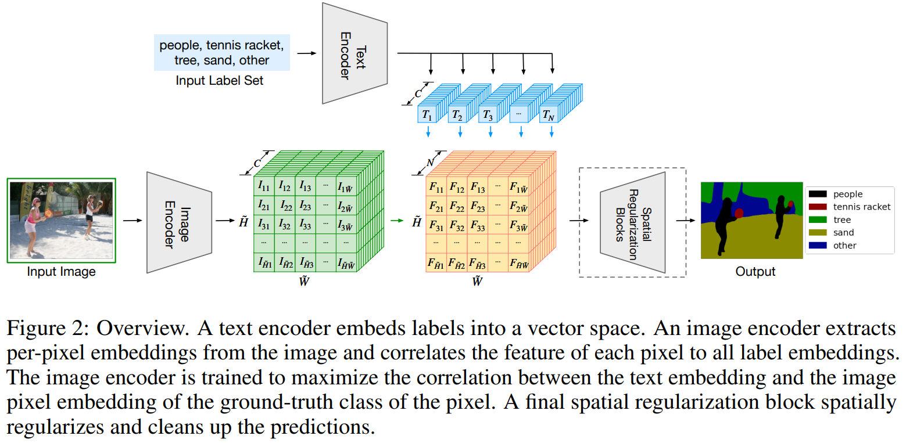</div>
    </details>

    [](https://arxiv.org/abs/2201.03546) [](https://github.com/isl-org/lang-seg)

👆 [Back to Top](#Table-of-Content)


**Citation**

If this work is helpful for your research, please consider citing the following BibTeX entry.
``` bibtex
TBD
```